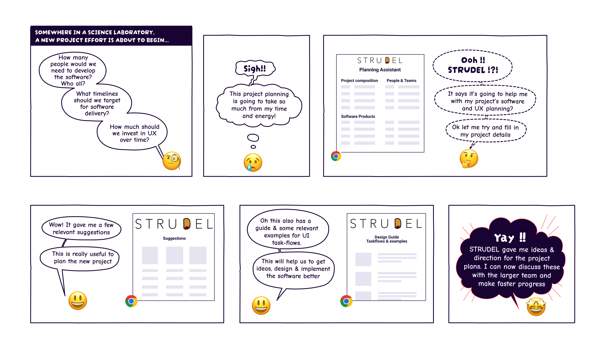

import { Box, Grid, Stack, Link as MuiLink, StepLabel, StepContent } from '@mui/material';
import { Hero } from '/src/components/Hero';
import { PageContainer } from '/src/components/PageContainer';
import { ContentCard } from '/src/components/ContentCard';
import { ProjectHistoryStepper, ProjectHistoryStep } from '/src/components/ProjectHistoryStepper';
import { Link } from 'gatsby';

<Hero>
## Mission

STRUDEL is an open source science project advocating for and advancing the inclusion of User Experience (UX) practices & tools in scientific software development.
</Hero>

<PageContainer>

## Motivation for User Experience in Science Software
<Stack spacing={3}>
    <Box>
        The user experience and sustainability of scientific software are pressing challenges since these foundational products impact the production of knowledge and scientific progress.
    </Box>
    <Box>
              <Grid container spacing={4}>
                <Grid item sm={3}>
                    <Box sx={{
                        backgroundColor: 'neutral.light',
                        borderRadius: 4,
                        height: '100%',
                        padding: 2,
                    }}>
                        Iterative scientific inquiry results in constantly evolving user needs.
                    </Box>
                </Grid>
                <Grid item sm={3}>
                    <Box sx={{
                        backgroundColor: 'neutral.light',
                        borderRadius: 4,
                        height: '100%',
                        padding: 2,
                    }}>
                    Software sustainability & efficiency requires regular UX investment.
                    </Box>
                </Grid>
                <Grid item sm={3}>
                    <Box sx={{
                        backgroundColor: 'neutral.light',
                        borderRadius: 4,
                        height: '100%',
                        padding: 2,
                    }}>
                    Science projects often lack UX processes & best practices.
                    </Box>
                </Grid>
                <Grid item sm={3}>
                    <Box sx={{
                        backgroundColor: 'neutral.light',
                        borderRadius: 4,
                        height: '100%',
                        padding: 2,
                    }}>
                    Commercial software practices require translation to science contexts.
                    </Box>
                </Grid>
              </Grid>
            </Box>
            <Box>User experience is often an afterthought in scientific software that impacts usability, accessibility, design, & functionality of products. Today the UX community for scientific software is growing and tackling these challenges.</Box>
</Stack>

## Our Vision
<Stack>
    <Box>
        STRUDEL is supporting scientific software development, and the growing science software UX community, through advocacy and the stewardship of key products. We aim to make adopting UX in science easier and more effective from project planning through product development.
    </Box>
    <Box>
        
    </Box>
</Stack>

## Funding
<Grid container columnSpacing={4}>
    <Grid item sm={8}>
        STRUDEL is generously funded by the Alfred P. Sloan Foundation, Liz Vu & Josh Greenberg Program Officers, initial grant <MuiLink href="https://sloan.org/grant-detail/10074" target="_blank" rel="noreferrer">#10074</MuiLink>.
    </Grid>
    <Grid item sm={4}>
        
    </Grid>

</Grid>

## Project History

The STRUDEL project emerged from the experiences of members in Lawrence Berkeley National Lab's computing sciences applying UX to scientific software products.

<ProjectHistoryStepper>
    <ProjectHistoryStep>
      <StepLabel>
        ### STRUDEL Design System v1.0 — Winter 2024
      </StepLabel>
      <StepContent>
        STRUDEL launched the initial version of a design system oriented around <Link to="about/glossary#task-flow">Task Flows</Link>, including visual design templates, guidelines, and code.
      </StepContent>
    </ProjectHistoryStep>
    <ProjectHistoryStep>
      <StepLabel>
        ### Formation of US-RSE UX Working Group – Nov 2023
      </StepLabel>
      <StepContent>
        STRUDEL shepherded the formation of a working group dedicated to UX within the US-RSE organization to help bring together UXers across science communities. 
      </StepContent>
    </ProjectHistoryStep>
    <ProjectHistoryStep>
      <StepLabel>
        ### Construction of initial Design System — Summer - Fall 2023
      </StepLabel>
      <StepContent>
        Task Flows were implemented in visual templates and code that can be downloaded and used as a starting point for scientific applications. 
      </StepContent>
    </ProjectHistoryStep>
    <ProjectHistoryStep>
      <StepLabel>
        ### Characterization of initial sociotechnical typology — Spring - Summer 2023
      </StepLabel>
      <StepContent>
        STRUDEL team organized elements of surveyed projects & sociotechnical literature to identify key questions and concepts shaping scientific software development work.
      </StepContent>
    </ProjectHistoryStep>
    <ProjectHistoryStep>
      <StepLabel>
        ### Conceptualization & design of Task Flows — Winter - Spring 2023
      </StepLabel>
      <StepContent>
        STRUDEL team generalized common patterns uncovered during the audit to generate <Link to="about/glossary#task-flow">Task Flows</Link> which can be used across different science domains and use cases.  
      </StepContent>
    </ProjectHistoryStep>
    <ProjectHistoryStep>
      <StepLabel>
        ### Audit & survey of DOE-funded science software UIs – Fall 2022 - Winter 2023
      </StepLabel>
      <StepContent>
        STRUDEL team gathered and documented screenshots and artifacts from several DOE funded product’s UIs and conducted interviews with software teams to identify common patterns.
      </StepContent>
    </ProjectHistoryStep>
    <ProjectHistoryStep>
      <StepLabel>
        ### STRUDEL project founded — 2022
      </StepLabel>
      <StepContent>
        The Alfred P. Sloan Foundation <MuiLink href="https://sloan.org/grant-detail/10074" target="_blank"> funded</MuiLink> the team at LBNL to create a typology and design system for scientific software after team participated in a <MuiLink href="https://web.cvent.com/event/1b7d7c3a-e9b4-409d-ae2b-284779cfe72f/summary" target="_blank">DOE workshop</MuiLink> on the Science of Scientific Software Development and Use.
      </StepContent>
    </ProjectHistoryStep>
    <ProjectHistoryStep>
    </ProjectHistoryStep>
    <ProjectHistoryStep>
    </ProjectHistoryStep>
    <ProjectHistoryStep>
      <StepLabel>
        ### <em>“Experiences with a Flexible User Research Process to Build Data Change Tools”</em> paper — Sept 2020
      </StepLabel>
      <StepContent>
        Team members <MuiLink href="https://dx.doi.org/10.5334/jors.284" target="_blank">published</MuiLink> experiences with adopting a flexible UX research process to influence scientific software development to raise awareness of user experience challenges.
      </StepContent>
    </ProjectHistoryStep>
    <ProjectHistoryStep>
      <StepLabel>
        ### <em>“Ten Principles for Creating Usable Software for Science”</em> paper - Oct 2017
      </StepLabel>
      <StepContent>
        Data Science & Technology group leaders published eScience conference paper outlining <MuiLink href="https://ieeexplore.ieee.org/document/8109139" target="_blank">core principles</MuiLink> for building usable science software based on team’s experiences.
      </StepContent>
    </ProjectHistoryStep>
    <ProjectHistoryStep>
        <StepLabel>
            ### Experiences applying user centered design to workflow APIs paper — 2014
        </StepLabel>
        <StepContent>
            Team <MuiLink href="https://ieeexplore.ieee.org/document/6972276" target="_blank">published</MuiLink> experiences applying user centered design practices to scientific workflow API development.
        </StepContent>
    </ProjectHistoryStep>
    <ProjectHistoryStep>
        <StepLabel>
            ### UX research & design across projects to create usable data abstractions, APIs, and more – 2013 - 2020
        </StepLabel>
        <StepContent>
            Data Science & Technology Department <MuiLink href="https://ux.lbl.gov" target="_blank">UX group</MuiLink> funded by <MuiLink href="https://science.osti.gov/ascr" target="_blank">DOE ASCR</MuiLink> to conduct foundational R&D with UX approach across variety of products. 
        </StepContent>
    </ProjectHistoryStep>
    <ProjectHistoryStep>
      <StepLabel>
        ### Initial application of user centered design in LBNL projects -  2006 - 2012
      </StepLabel>
      <StepContent>
        Teams in Data Science & Technology Department (now <MuiLink href="https://crd.lbl.gov/divisions/scidata/" target="_blank">Scientific Data Division</MuiLink>) began adopting user centered design practices when building scientific software.
      </StepContent>
    </ProjectHistoryStep>
</ProjectHistoryStepper>

</PageContainer>