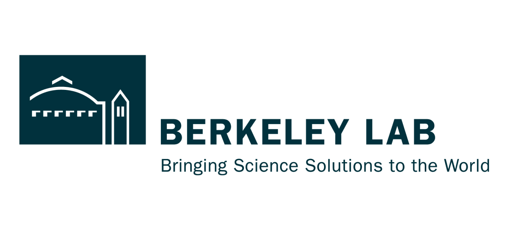
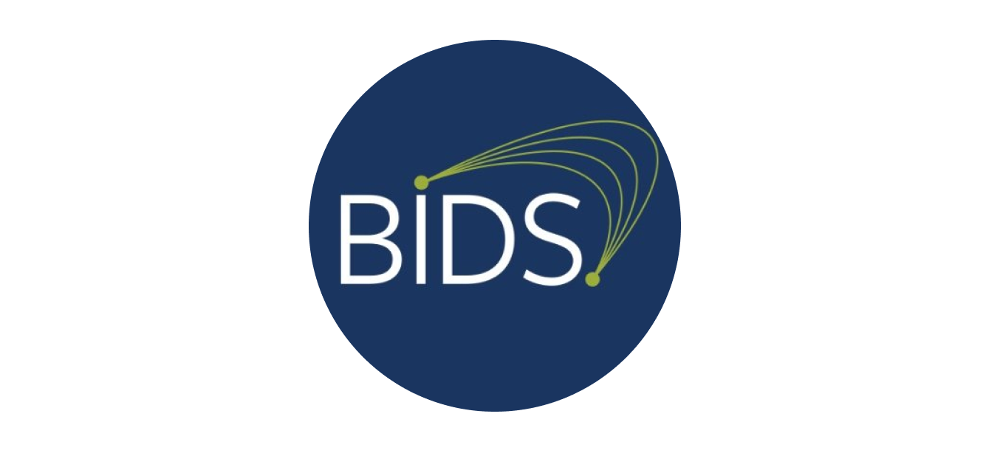
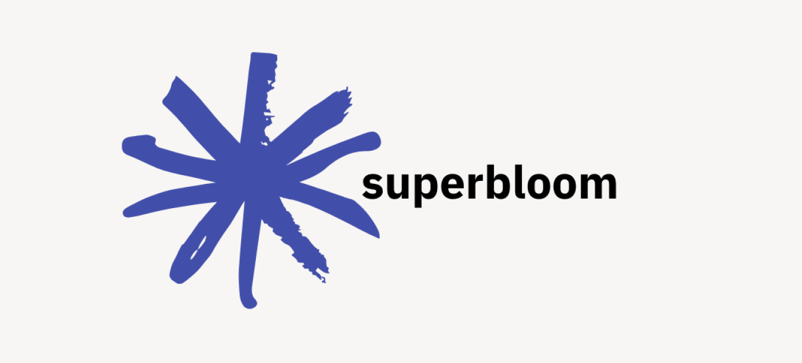
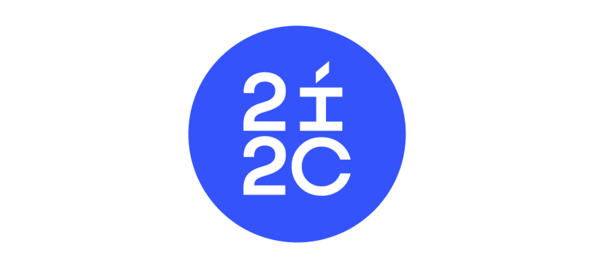
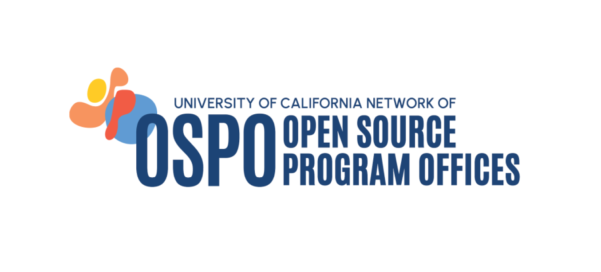
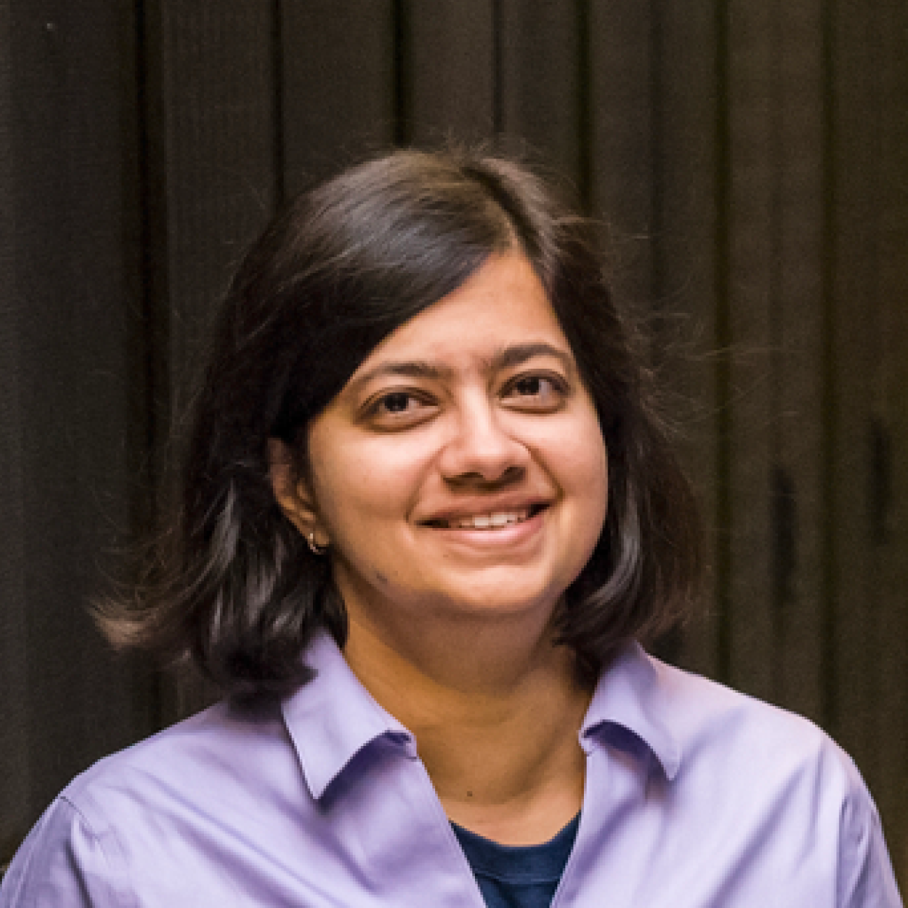
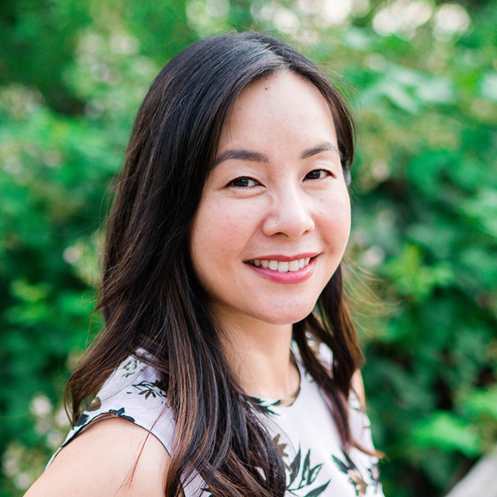
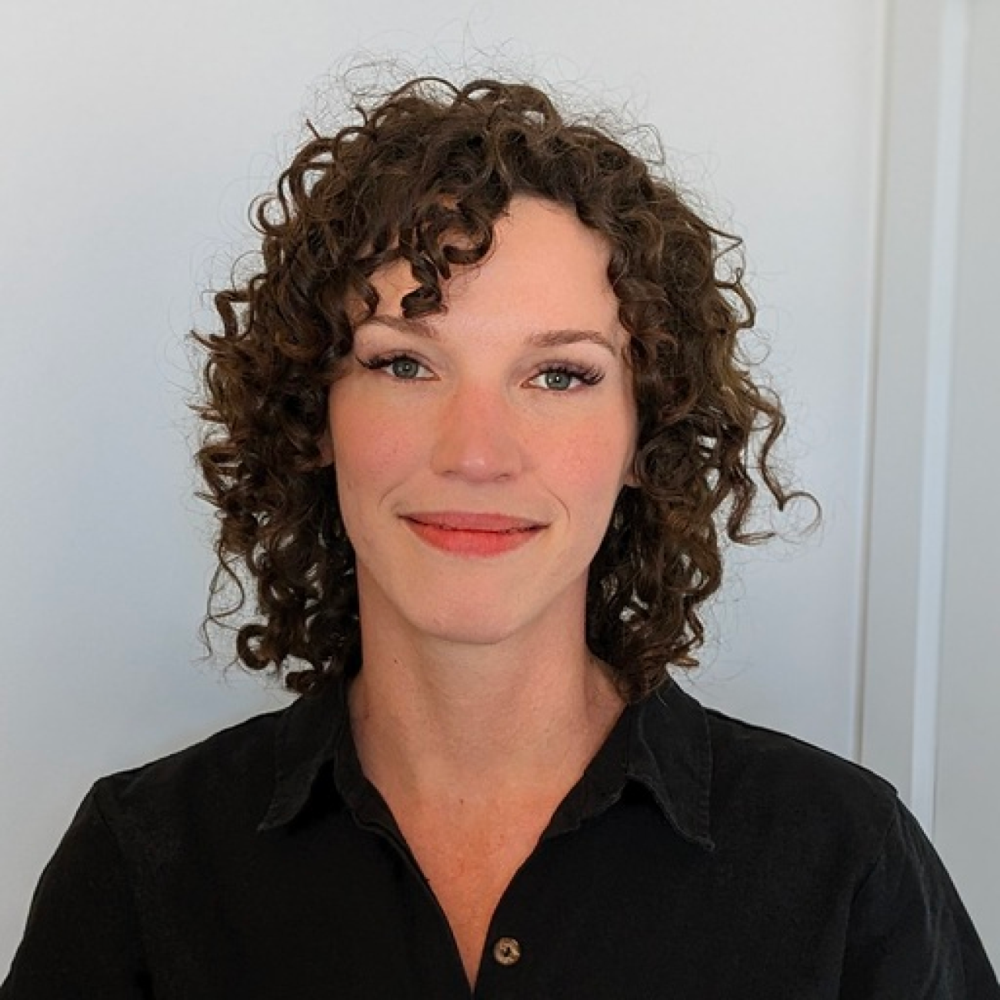

import { Box, Grid, Stack, Typography, StepLabel, StepContent } from '@mui/material';
import { PageContainer } from '/src/components/PageContainer';
import { Hero } from '/src/components/Hero';
import { Link } from '@mui/material';

<PageContainer>

## Partners

	<Grid container columnSpacing={4}>
		<Grid item md={4} sm={6}>
		<Box
			sx={{
			textAlign: 'center',
			padding: 1,
			marginTop: '32px'
			}}>
			<Box
			sx={{
				maxHeight: '110px',
				'& .gatsby-image-wrapper': {
				borderRadius: '50%',
				}
			}}
			>
			
			</Box>
			
		</Box>
		</Grid>
		<Grid item md={4} sm={6}>
		<Box
			sx={{
			textAlign: 'center',
			padding: 1,
			marginTop: '32px'
			}}>
			<Box
			sx={{
				maxHeight: '110px',
				width: 'auto',
				'& .gatsby-image-wrapper': {
				borderRadius: '50%',
				}
			}}
			>
			
			</Box>
			
		</Box>
		</Grid>
		<Grid item md={4} sm={6}>
		<Box
			sx={{
			textAlign: 'center',
			padding: 1,
			marginTop: '32px'
			}}>
			<Box
			sx={{
			maxHeight: '110px',
				'& .gatsby-image-wrapper': {
				borderRadius: '50%',
				}
			}}
			>
			
			</Box>
			
		</Box>
		</Grid>
		<Grid item md={4} sm={6}>
		<Box
			sx={{
			textAlign: 'center',
			padding: 1,
			marginTop: '32px'
			}}>
			<Box
			sx={{
				maxHeight: '110px',
				'& .gatsby-image-wrapper': {
				borderRadius: '50%',
				}
			}}
			>
			
			</Box>
			
		</Box>
		</Grid>
		<Grid item md={4} sm={6}>
		<Box
			sx={{
			textAlign: 'center',
			padding: 1,
			marginTop: '32px'
			}}>
			<Box
			sx={{
				maxHeight: '110px',
				'& .gatsby-image-wrapper': {
				borderRadius: '50%',
				}
			}}
			>
			
			</Box>
			
		</Box>
		</Grid>
		<Grid item md={4} sm={6}>
		<Box
			sx={{
			textAlign: 'center',
			padding: 1,
			marginTop: '32px'
			}}>
			<Box
			sx={{
				maxHeight: '110px',
				'& .gatsby-image-wrapper': {
				borderRadius: '50%',
				}
			}}
			>
			
			</Box>
			
		</Box>
		</Grid>
	</Grid>

## People

	<Grid container columnSpacing={8}>
		<Grid item md={4} sm={6}>
		<Box
			sx={{
			textAlign: 'center',
			border: '2px dotted',
			borderColor: 'error.main',
			borderRadius: '16px',
			padding: 1,
			marginTop: '32px'
			}}>
			<Box
			sx={{
				width: '100%',
				'& .gatsby-image-wrapper': {
				borderRadius: '50%',
				}
			}}
			>
			
			</Box>
			Lavanya Ramakrishnan 
			<em>Senior Computer Scientist/SciData Division Deputy, PI, LBNL</em>
		</Box>
		</Grid>
		<Grid item md={4} sm={6}>
		<Box
			sx={{
			textAlign: 'center',
			border: '2px dotted',
			borderColor: 'error.main',
			borderRadius: '16px',
			padding: 1,
			marginTop: '32px'
			}}>
				<Box
				sx={{
					width: '100%',
					'& .gatsby-image-wrapper': {
					borderRadius: '50%',
					}
				}}
				>
					
				</Box>
				Dan Gunter 
				<em>Usable Data Systems Group Lead, LBNL</em>
		</Box>
		</Grid>
		<Grid item md={4} sm={6}>
		<Box
			sx={{
			textAlign: 'center',
			border: '2px dotted',
			borderColor: 'error.main',
			borderRadius: '16px',
			padding: 1,
			marginTop: '32px'
			}}>
			<Box
			sx={{
				width: '100%',
				'& .gatsby-image-wrapper': {
				borderRadius: '50%',
				}
			}}
			>
			
			</Box>
			Sarah Poon 
			<em>User Experience Designer (UXD), LBNL</em>
		</Box>
		</Grid>
		<Grid item md={4} sm={6}>
		<Box
			sx={{
			textAlign: 'center',
			border: '2px dotted',
			borderColor: 'error.main',
			borderRadius: '16px',
			padding: 1,
			marginTop: '32px'
			}}>
			<Box
			sx={{
				width: '100%',
				'& .gatsby-image-wrapper': {
				borderRadius: '50%',
				}
			}}
			>
			
			</Box>
			Drew Paine 
			<em>User Experience Researcher (UXR), LBNL</em>
		</Box>
		</Grid>
		<Grid item md={4} sm={6}>
		<Box
			sx={{
			textAlign: 'center',
			border: '2px dotted',
			borderColor: 'error.main',
			borderRadius: '16px',
			padding: 1,
			marginTop: '32px',
			minWidth: '250px',
			}}>
			<Box
			sx={{
				width: '100%',
				'& .gatsby-image-wrapper': {
				borderRadius: '50%',
				}
			}}
			>
			
			</Box>
			Cody O'Donnell 
			<em>User Experience Engineer (UXE), LBNL</em>
		</Box>
		</Grid>
		<Grid item md={4} sm={6}>
		<Box
			sx={{
			textAlign: 'center',
			border: '2px dotted',
			borderColor: 'error.main',
			borderRadius: '16px',
			padding: 1,
			marginTop: '32px'
			}}>
			<Box
			sx={{
				width: '100%',
				'& .gatsby-image-wrapper': {
				borderRadius: '50%',
				}
			}}
			>
			
			</Box>
			Rajshree Deshmukh 
			<em>User Experience Designer (UXD), LBNL</em>
		</Box>
		</Grid>
		<Grid item md={4} sm={6}>
		<Box
			sx={{
			textAlign: 'center',
			border: '2px dotted',
			borderColor: 'error.main',
			borderRadius: '16px',
			padding: 1,
			marginTop: '32px'
			}}>
			<Box
			sx={{
				width: '100%',
				'& .gatsby-image-wrapper': {
				borderRadius: '50%',
				}
			}}
			>
			
			</Box>
			Hannah Cohoon 
			<em>User Experience Researcher (UXR), LBNL</em>
		</Box>
		</Grid>

	</Grid>

## Alumni
	- Maarten Lopes 
			<em>Intern, LBNL</em>
	- Tiffany Win 
			<em>Communications Specialist, LBNL</em>

</PageContainer>

