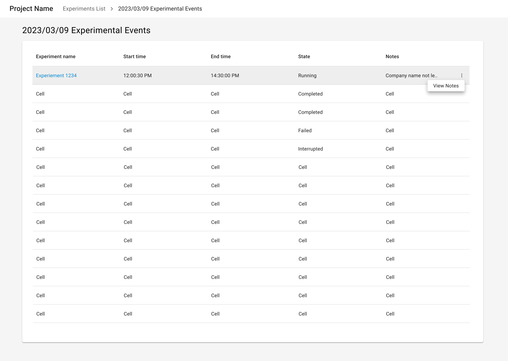
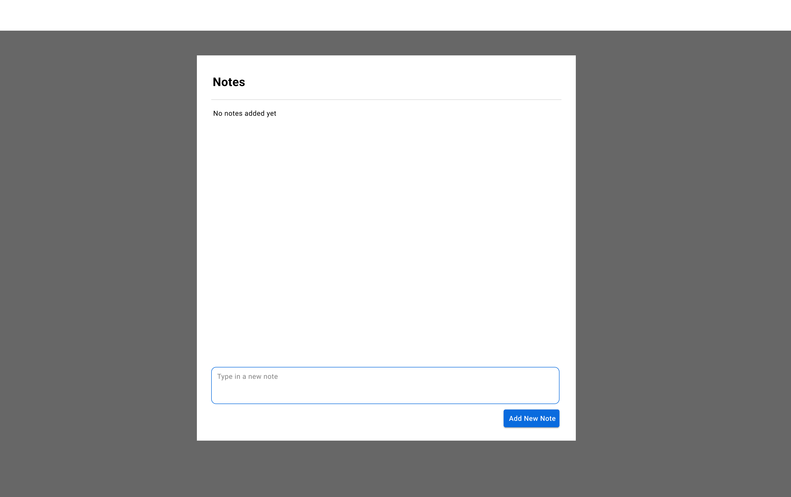
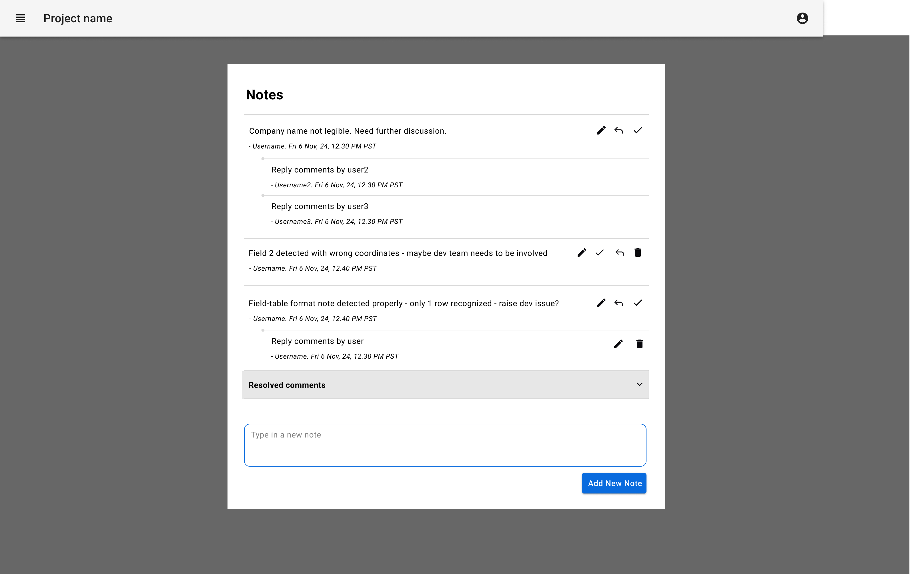
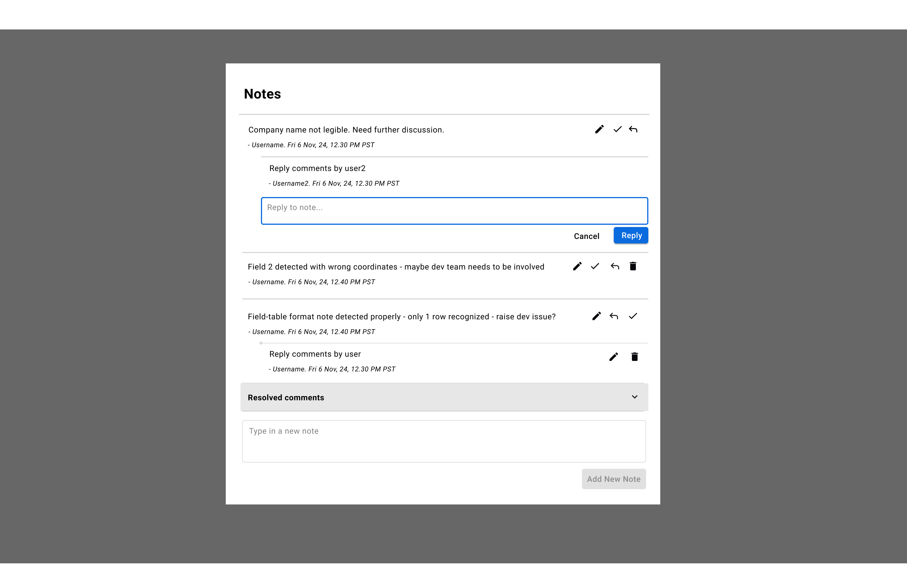
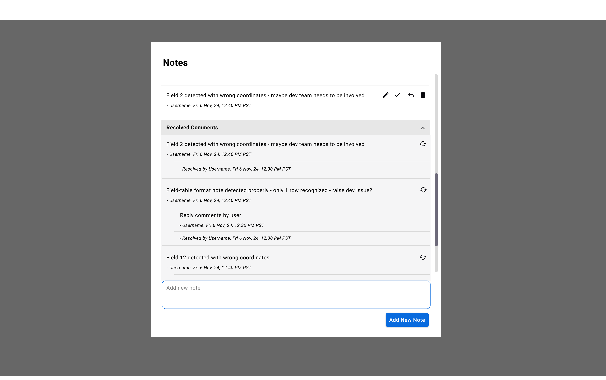

import { Grid, TableHead, TableRow, TableCell, TableBody } from '@mui/material';
import { TaskFlowCard } from '/src/components/TaskFlowCard';
import { InfoTable } from '/src/components/InfoTable';

## Overview

<Grid container spacing={4}>
  <Grid item xs={6} md={4}>
    
  </Grid>
  <Grid item xs={6} md={4}>
    
  </Grid>
  <Grid item xs={6} md={4}>
    
  </Grid>
  <Grid item xs={6} md={4}>
    
  </Grid>
  <Grid item xs={6} md={4}>
    
  </Grid>
</Grid>

### Guidelines for adapting the Task Flow

<ul>
  <li>
    Determine if the entity needs simple linear notes, or complex notes/ comments with nested replies and resolve actions
  </li>
  <li>
    Give a clear and visible call-to-action button on entity details view, and if necessary -- on the entities datatable overview. 
  </li>
  <li>
    Assess how important and frequently accessed the notes are, and, if justified, display a truncated notes column in the list view to enable quick scanning.
  </li>
  <li>
    Assess how much context should be preserved. Based on this, decide whether to allow users to edit or delete their notes, and display timestamps for when each note was created or last modified.
  </li>
  <li>
    Determine if actions like resolving or reopening notes/comments are needed. They are most useful in structured collaboration, such as reviews, approvals, or issue tracking.
  </li>
  <li>
    In case of tasks which can accumulate lot of notes/ comments, consider giving options to search notes and filter “All,” “Open,” and “Resolved” notes/ comments.
  </li>
</ul>

{/*
## Variations & Examples

Aliquip ea ipsum Lorem amet incididunt excepteur Lorem aute proident deserunt commodo. Officia ipsum magna laborum dolore mollit adipisicing eiusmod. Duis irure ullamco in aliquip eu ad aliquip elit cupidatat.

*/}

## Related Task Flows

<Grid container spacing={4}>
  <Grid item md={6}>
    <TaskFlowCard name="Explore Data" />
  </Grid>
  <Grid item md={6}>
    <TaskFlowCard name="Run Computation" />
  </Grid>
</Grid>