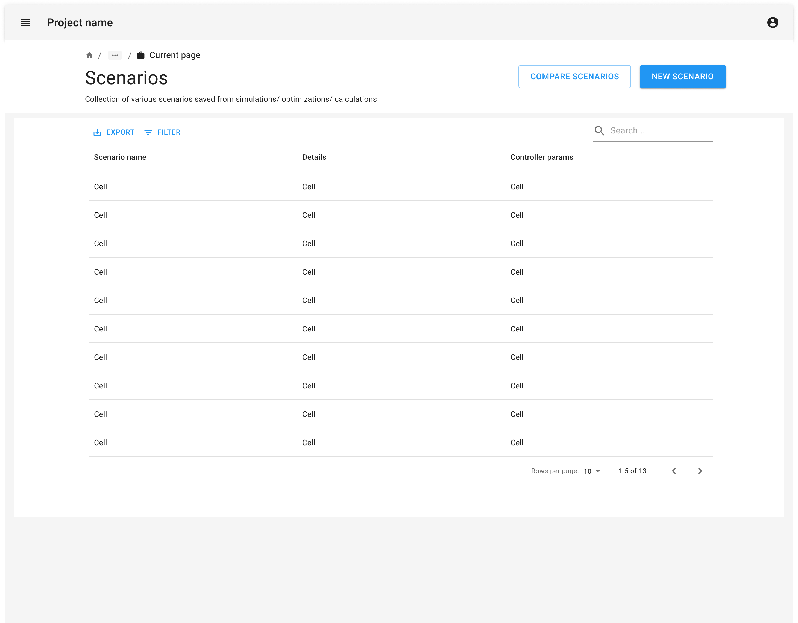
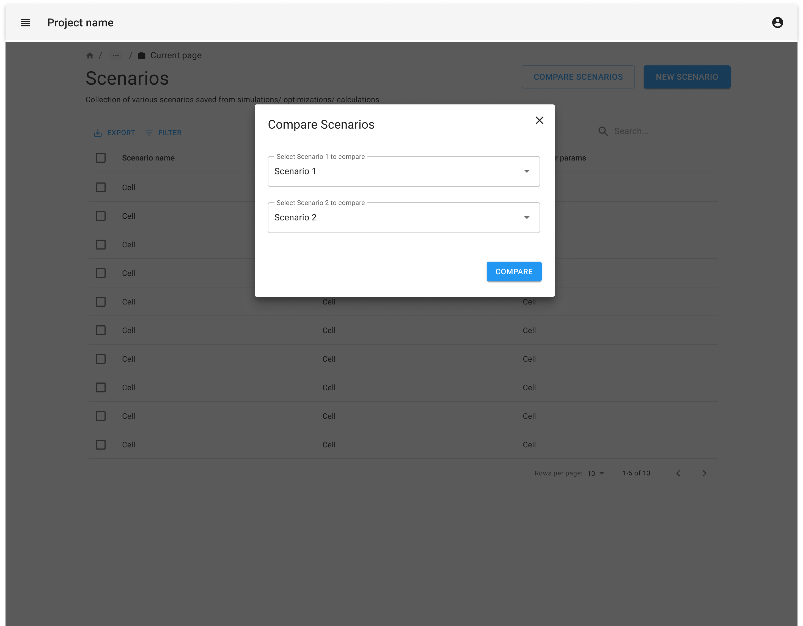
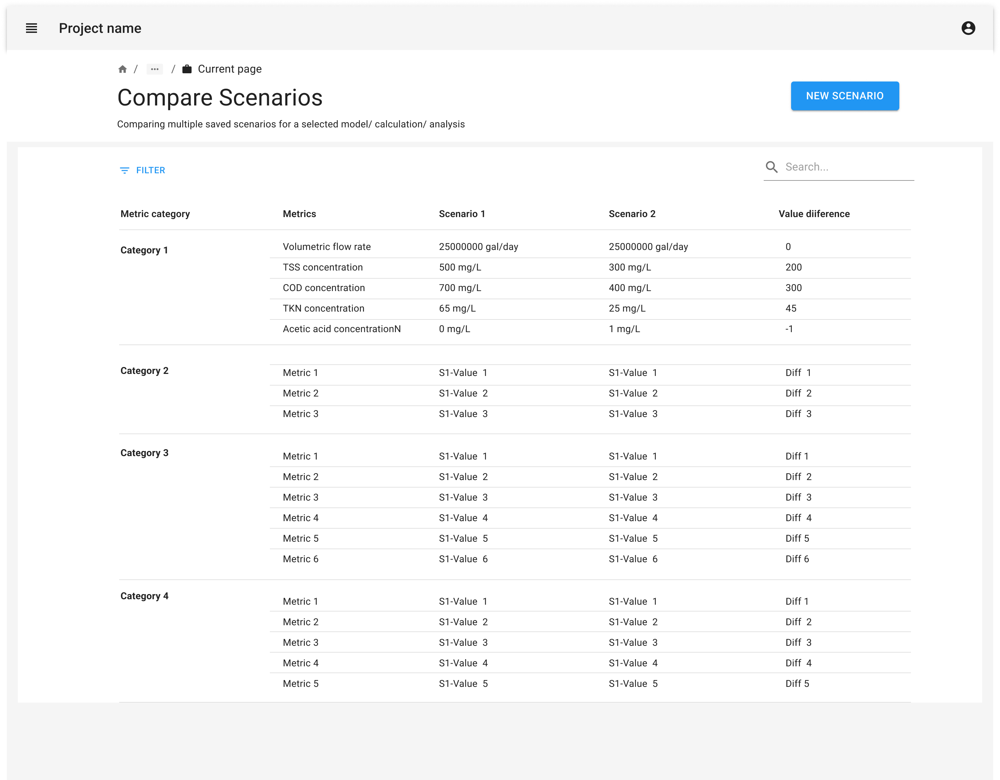

import { Grid, TableHead, TableRow, TableCell, TableBody } from '@mui/material';
import { TaskFlowCard } from '/src/components/TaskFlowCard';
import { InfoTable } from '/src/components/InfoTable';

## Overview

<Grid container spacing={4}>
  <Grid item xs={6} md={4}>
    
  </Grid>
  <Grid item xs={6} md={4}>
    
  </Grid>
  <Grid item xs={6} md={4}>
    
  </Grid>
</Grid>

### Guidelines for adapting the Task Flow

<ul>
  <li>
    Consider whether the users would want to compare 2 sets of attributes or more than 2 sets. 
    <ul>
      <li>
        When comparing 2 sets of attributes, you can represent the differences between the sets as a subtraction between values or showing side by side values. These deltas can also be represented as a plot. 
      </li>
      <li>
        When comparing more than 2 sets of attributes, you can consider displaying values of each set as columns in a table. Also consider visualizations to aid in comparison.
      </li>
    </ul>
  </li>
  <li>
    Data visualizations like graphs and charts can help to highlight the differences and similarities between  sets being compared.
  </li>
  <li>
    Prioritize the attributes which are critical for comparison instead of exposing all of the attributes in a single view.
  </li>
  <li>
    If there are too many attributes to compare, allow users to prioritize comparisons by providing ways to search & filter the attributes. This makes it easier for them to focus on their interests instead of getting overwhelmed by a large comparison matrix.
  </li>
  <li>
   Consider offering an expanded view of a selected set or attribute to view additional related details, data tables, or diagrams. The expanded view could be displayed in a pop-up or a vertical or horizontal slide out panel.
  </li>
  <li>
   Consider providing the ability to save or export comparison results.
  </li>
</ul>

{/*
## Variations & Examples

Aliquip ea ipsum Lorem amet incididunt excepteur Lorem aute proident deserunt commodo. Officia ipsum magna laborum dolore mollit adipisicing eiusmod. Duis irure ullamco in aliquip eu ad aliquip elit cupidatat.

## Components & Patterns Used

<InfoTable>
  <TableHead>
    <TableRow>
      <TableCell>Component</TableCell>
      <TableCell>Usage Context</TableCell>
      <TableCell>Links to Libraries</TableCell>
    </TableRow>
  </TableHead>
  <TableBody>
    <TableRow>
      <TableCell>Stepper</TableCell>
      <TableCell>Some blurb on how the component is useful in this taskflow</TableCell>
      <TableCell><a href="https://mui.com/material-ui/react-stepper/" target="_blank">MUI links to start with</a></TableCell>
    </TableRow>
    <TableRow>
      <TableCell>Data Grid</TableCell>
      <TableCell>Some blurb on how the component is useful in this taskflow</TableCell>
      <TableCell><a href="https://mui.com/x/react-data-grid/" target="_blank">MUI links to start with</a></TableCell>
    </TableRow>
    <TableRow>
      <TableCell>Date Picker</TableCell>
      <TableCell>Some blurb on how the component is useful in this taskflow</TableCell>
      <TableCell><a href="https://mui.com/x/react-date-pickers/" target="_blank">MUI links to start with</a></TableCell>
    </TableRow>
    <TableRow>
      <TableCell>Select</TableCell>
      <TableCell>Some blurb on how the component is useful in this taskflow</TableCell>
      <TableCell><a href="https://mui.com/material-ui/react-select/">MUI links to start with</a></TableCell>
    </TableRow>
  </TableBody>
</InfoTable>
*/}

## Related Task Flows

<Grid container spacing={4}>
  <Grid item md={6}>
    <TaskFlowCard name="Explore Data" />
  </Grid>
  <Grid item md={6}>
    <TaskFlowCard name="Contribute Data" />
  </Grid>
</Grid>