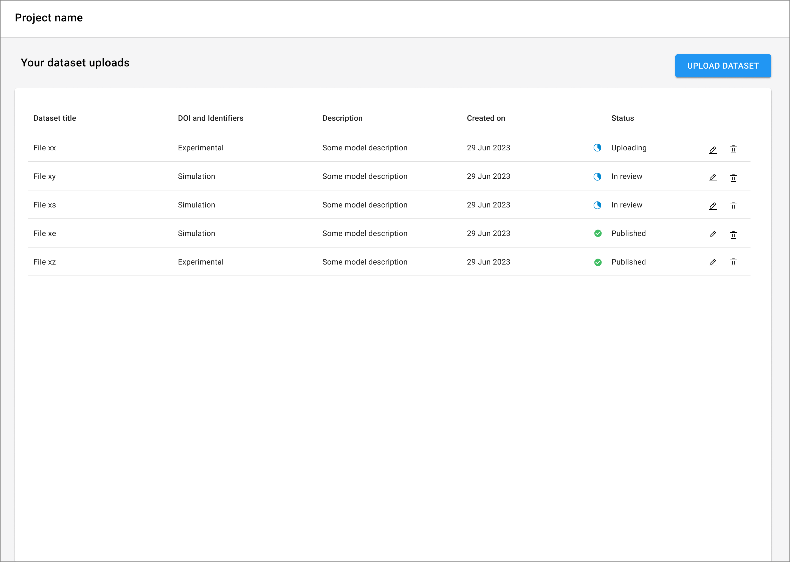
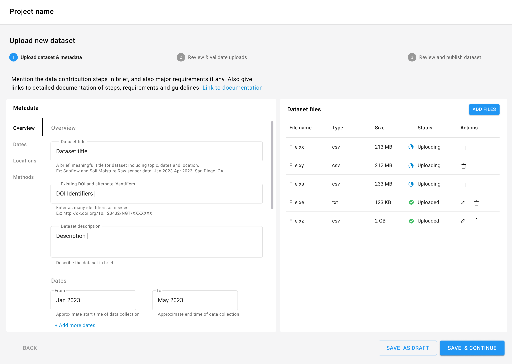
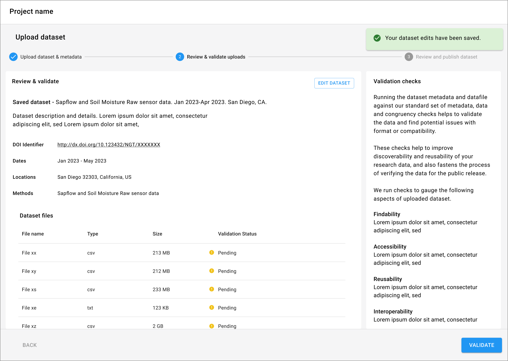
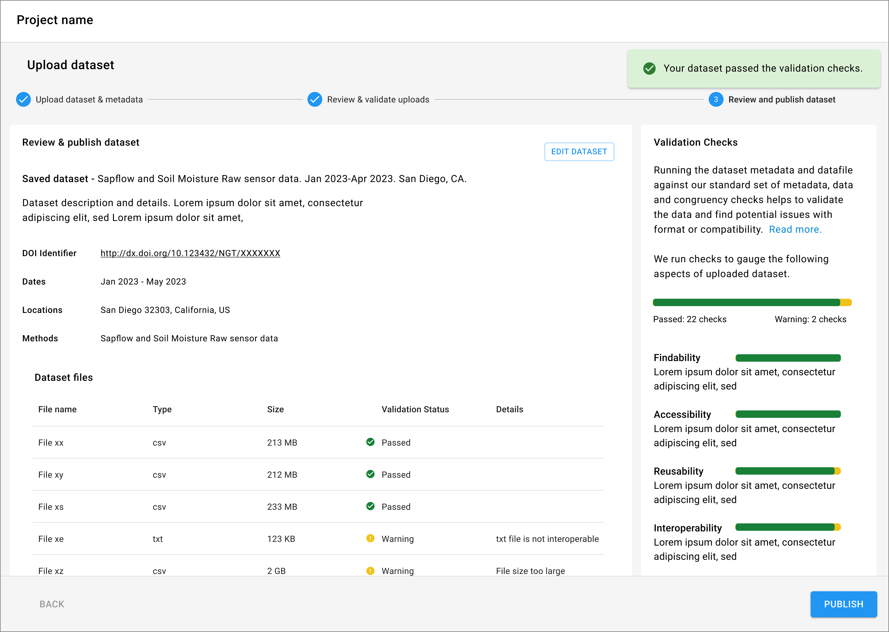

import { Grid, TableHead, TableRow, TableCell, TableBody } from '@mui/material';
import { TaskFlowCard } from '/src/components/TaskFlowCard';
import { InfoTable } from '/src/components/InfoTable';

## Overview

<Grid container spacing={4}>
  <Grid item xs={6} md={4}>
    
  </Grid>
  <Grid item xs={6} md={4}>
    
  </Grid>
  <Grid item xs={6} md={4}>
    
  </Grid>
  <Grid item xs={6} md={4}>
    
  </Grid>
</Grid>

### Guidelines for adapting the Task Flow

<ul>
  <li>
    Determine the primary information required to identify a contributed dataset, and use this to display the contribution table to the user
  </li>
  <li>
    Define the process of data contribution and the stages involved in the verification and acceptance of submitted data. 
  </li>
  <li>
    Group the data required from users into relevant categories and split the process into a small number of steps to keep the flow simple.
  </li>
  <li>
    Give a progress indicator showing users where they are at in the overall flow.
  </li>
  <li>
    The first step of collecting meta data and uploading files could get complex.  Users may need to work on the this step over multiple sessions and would need a ‘Save as draft’ option.
  </li>
  <li>
    Uploading files could take long time and running in the background should be supported.
  </li>
  <li>
    Provide a review step to confirm user submission details.
  </li>
  <li>
    Provide a status indicator to show users where they are in the contribution lifecycle (i.e. draft, in review, etc) and whether their dataset is currently public or private.
  </li>
  <li>
    A dataset submitted to a community repository will need to be verified for quality control and it will likely take some time before it is published. Associate statuses with every submission to show users what stage the submitted dataset is at in the process.
  </li>
  <li>
    Consider offering an automated validation step to check file formats, sizes, and any other basic data checks which can save time during further manual verification work.
  </li>
</ul>

{/*
## Variations & Examples

Aliquip ea ipsum Lorem amet incididunt excepteur Lorem aute proident deserunt commodo. Officia ipsum magna laborum dolore mollit adipisicing eiusmod. Duis irure ullamco in aliquip eu ad aliquip elit cupidatat.

## Components & Patterns Used

<InfoTable>
  <TableHead>
    <TableRow>
      <TableCell>Component</TableCell>
      <TableCell>Usage Context</TableCell>
      <TableCell>Links to Libraries</TableCell>
    </TableRow>
  </TableHead>
  <TableBody>
    <TableRow>
      <TableCell>Stepper</TableCell>
      <TableCell>Some blurb on how the component is useful in this taskflow</TableCell>
      <TableCell><a href="https://mui.com/material-ui/react-stepper/" target="_blank">MUI links to start with</a></TableCell>
    </TableRow>
    <TableRow>
      <TableCell>Data Grid</TableCell>
      <TableCell>Some blurb on how the component is useful in this taskflow</TableCell>
      <TableCell><a href="https://mui.com/x/react-data-grid/" target="_blank">MUI links to start with</a></TableCell>
    </TableRow>
    <TableRow>
      <TableCell>Date Picker</TableCell>
      <TableCell>Some blurb on how the component is useful in this taskflow</TableCell>
      <TableCell><a href="https://mui.com/x/react-date-pickers/" target="_blank">MUI links to start with</a></TableCell>
    </TableRow>
    <TableRow>
      <TableCell>Select</TableCell>
      <TableCell>Some blurb on how the component is useful in this taskflow</TableCell>
      <TableCell><a href="https://mui.com/material-ui/react-select/">MUI links to start with</a></TableCell>
    </TableRow>
  </TableBody>
</InfoTable>
*/}

## Related Task Flows

<Grid container spacing={4}>
  <Grid item md={6}>
    <TaskFlowCard name="Search Data Repositories" />
  </Grid>
  <Grid item md={6}>
    <TaskFlowCard name="Explore Data" />
  </Grid>
</Grid>