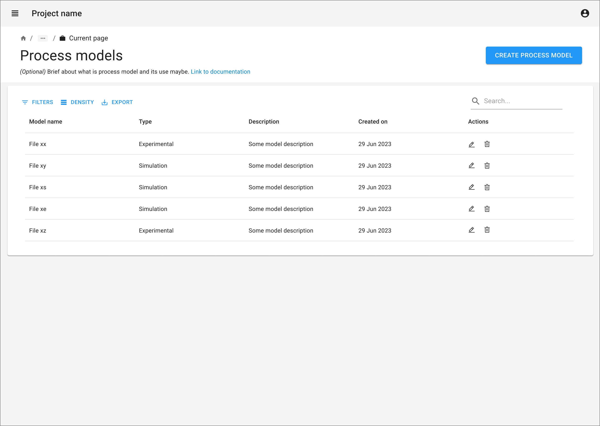
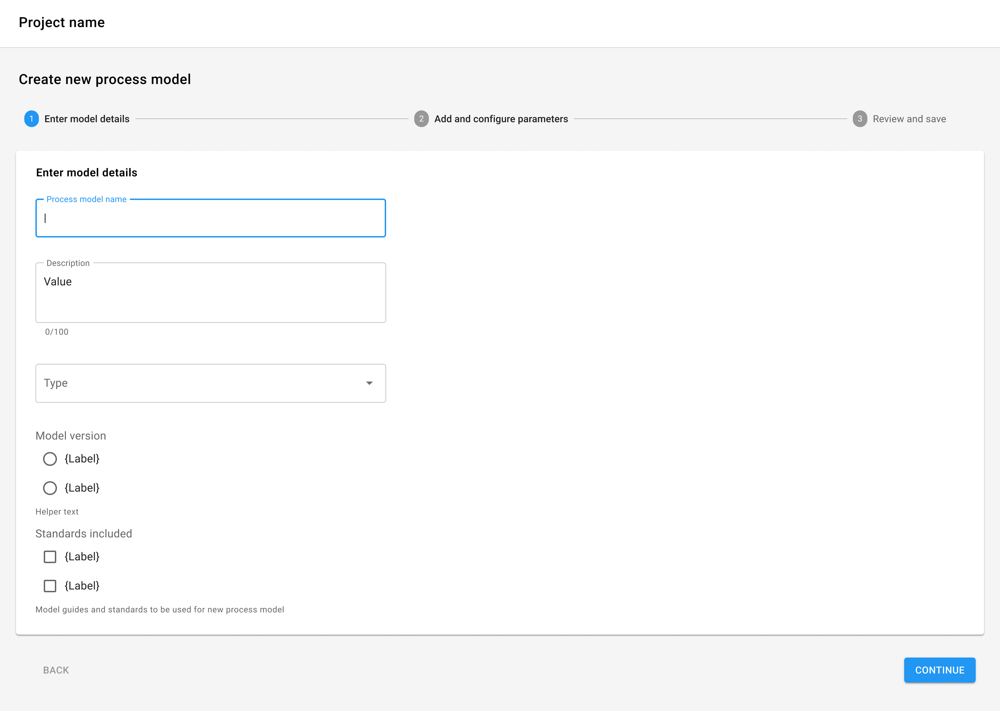
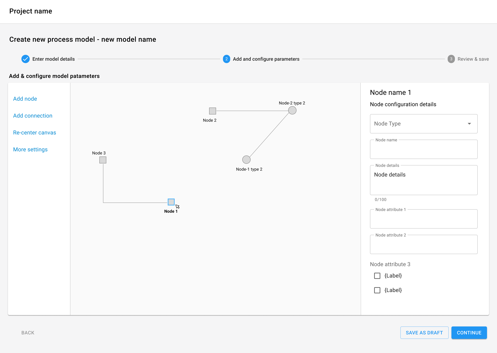
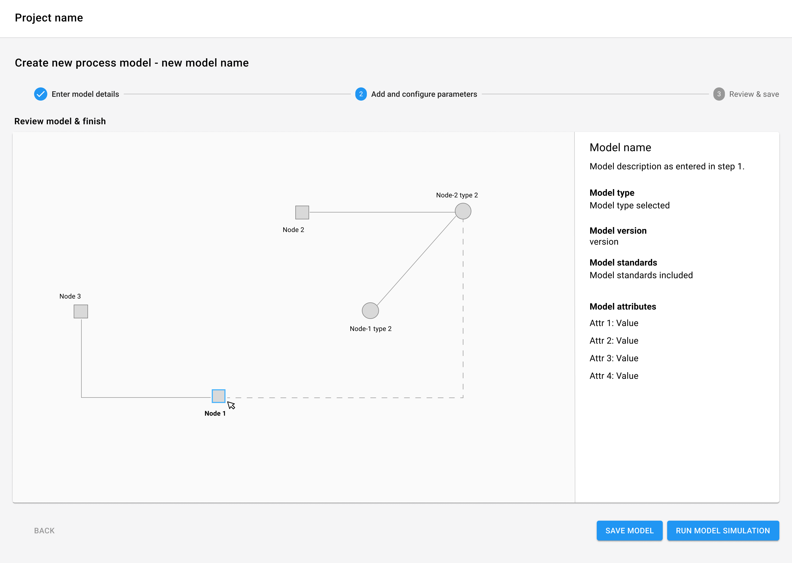

import { Grid, TableHead, TableRow, TableCell, TableBody } from '@mui/material';
import { TaskFlowCard } from '/src/components/TaskFlowCard';
import { InfoTable } from '/src/components/InfoTable';

## Overview

<Grid container spacing={4}>
  <Grid item xs={6} md={4}>
    
  </Grid>
  <Grid item xs={6} md={4}>
    
  </Grid>
  <Grid item xs={6} md={4}>
    
  </Grid>
  <Grid item xs={6} md={4}>
    
  </Grid>
</Grid>

### Guidelines for adapting the Task Flow

<ul>
  <li>
    Determine and group the different inputs needed to creating a new process graph/ model
  </li>
  <li>
    Start with the primary details needed to identify the process model
  </li>
  <li>
    If there is a long list of primary details for inputs, break it down into smaller sections with a left navigation panel
  </li>
  <li>
    Consider pre-setting inputs to defaults wherever possible
  </li>
  <li>
   Give progress indicator to show users where they are at the creation process
  </li>
  <li>
   The process model often requires a canvas interaction for model elements. Give the controls to add model elements in the left panel while the details of the elements can be set in a right panel
  </li>
  <li>
   Since this can be a time consuming task-flow, give users a way to save the current progress as a draft version
  </li>
  <li>
   Before final save, let users review all the model information they have configured
  </li>
  <li>
   After configuring the model, the next steps could be running a simulation or calculation on the model. Consider showing the next steps to users to ease their work flows.
  </li>
</ul>

{/*
## Variations & Examples

Aliquip ea ipsum Lorem amet incididunt excepteur Lorem aute proident deserunt commodo. Officia ipsum magna laborum dolore mollit adipisicing eiusmod. Duis irure ullamco in aliquip eu ad aliquip elit cupidatat.

*/}

## Related Task Flows

<Grid container spacing={4}>
  <Grid item md={6}>
    <TaskFlowCard name="Explore Data" />
  </Grid>
  <Grid item md={6}>
    <TaskFlowCard name="Run Computation" />
  </Grid>
</Grid>