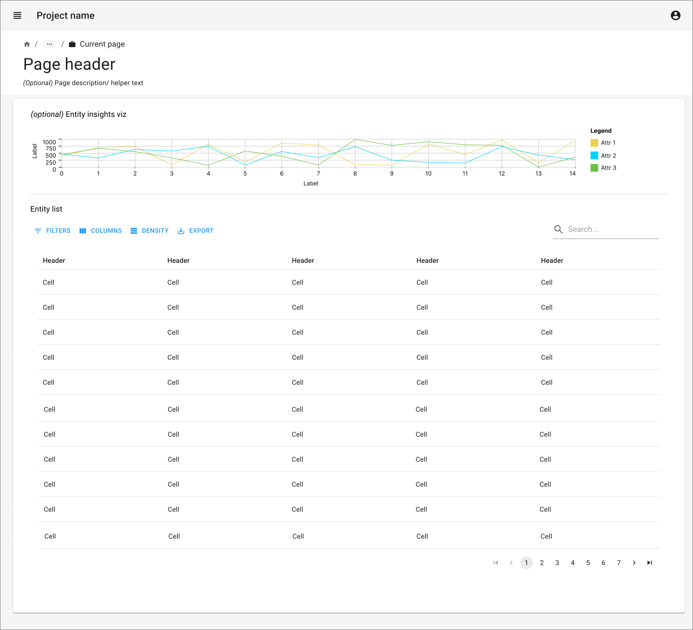
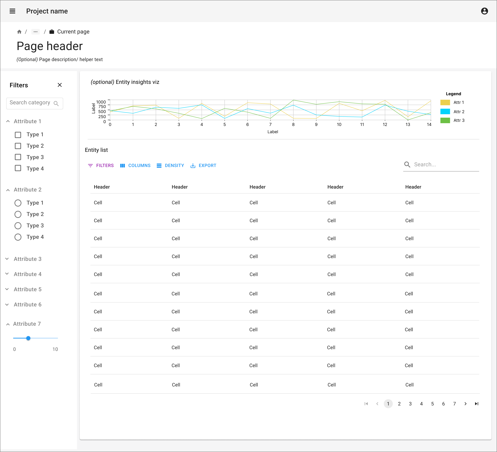
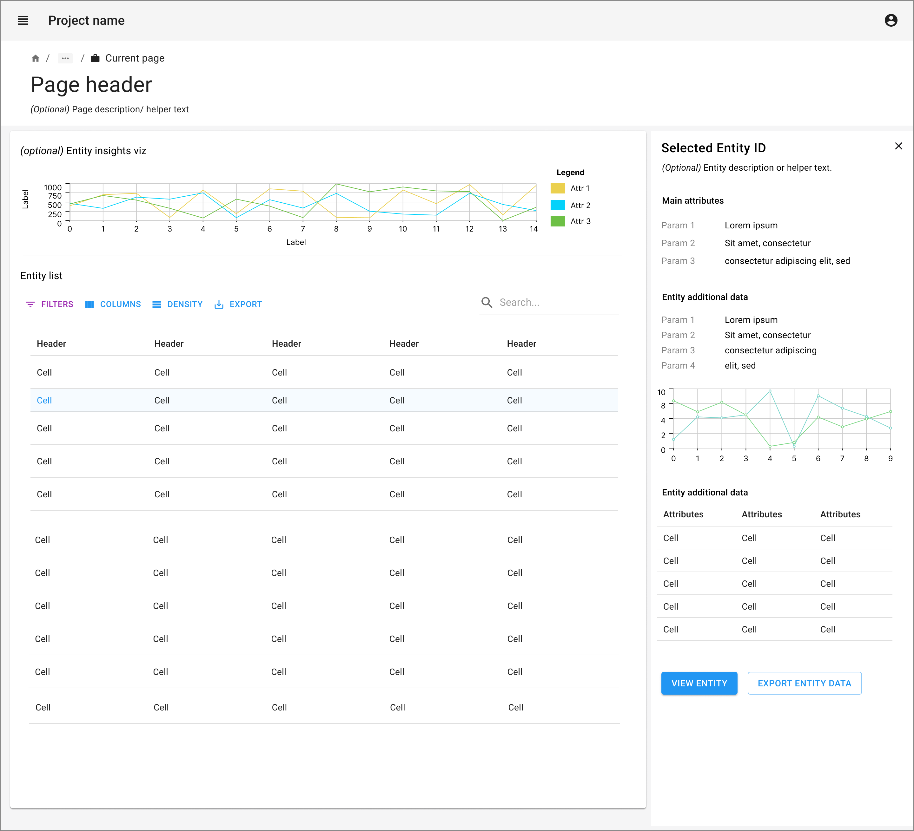
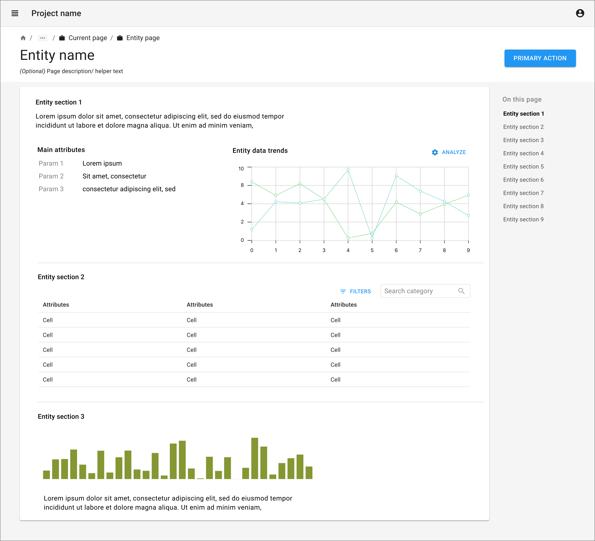

import { Grid, TableHead, TableRow, TableCell, TableBody } from '@mui/material';
import { TaskFlowCard } from '/src/components/TaskFlowCard';
import { InfoTable } from '/src/components/InfoTable';

## Overview

<Grid container spacing={4}>
  <Grid item xs={6} md={4}>
    
  </Grid>
  <Grid item xs={6} md={4}>
    
  </Grid>
  <Grid item xs={6} md={4}>
    
  </Grid>
  <Grid item xs={6} md={4}>
    
  </Grid>
</Grid>

### Guidelines for adapting the Task Flow

<ul>
 <li>
  <b>Data table:</b>
    <ul>
    <li>
      Search and filter capabilities are very important to make information findable and accessible.
    </li>
    <li>
      Data tables can have pagination or lazy load with scrolling option. Pagination is usually better interaction for data as users can refer to the page numbers to jump further to find a particular piece of information if they don’t want to use search and filter options. 
    </li>
    <li>
      Consider giving options for number of rows that can be viewed in single page.
    </li>
    <li>
      Clicking on row can trigger opening summary view in side panel for the selected entity.
    </li>
    <li>
      Consider not displaying all data values in the data table to optimize signal to noise. Focus on showing only important fields, with ancillary fields as optional hidden fields or available through detail views. 
    </li>
    <li>
      Pay attention to the principles of recognition over recall. Display as many fields in the data table as are necessary to accomplish a task or goal without needing further reference.
    </li>
    <li>
      For a more detailed view, link the entity name or identifier to navigate to the detailed view page. It may also be triggered via a primary button on a summary view panel.
    </li>
    <li>
      Data table can be accompanied with a graph or summary statistics to give overview about important data points. Consider brushing and linking between the graphs / plots and the data table. 
    </li>
    <li>
      Individual rows may require actions. A single button may be displayed as a column at the end of the row. If there are multiple actions available, consider icons or a dropdown actions menu on each row. 
    </li>
    </ul>
  </li>
  <li>
    <b>Data detail view:</b>
    <ul>
      <li>
        Give proper title and breadcrumb navigation on top header to go back to main data table.
      </li>
      <li>
        Consider giving in-page navigation section if it contains too many sections with lot of data.
      </li>
    </ul>
  </li>
</ul>

{/*
## Variations & Examples

Aliquip ea ipsum Lorem amet incididunt excepteur Lorem aute proident deserunt commodo. Officia ipsum magna laborum dolore mollit adipisicing eiusmod. Duis irure ullamco in aliquip eu ad aliquip elit cupidatat.

## Components & Patterns Used

<InfoTable>
  <TableHead>
    <TableRow>
      <TableCell>Component</TableCell>
      <TableCell>Usage Context</TableCell>
      <TableCell>Links to Libraries</TableCell>
    </TableRow>
  </TableHead>
  <TableBody>
    <TableRow>
      <TableCell>Stepper</TableCell>
      <TableCell>Some blurb on how the component is useful in this taskflow</TableCell>
      <TableCell><a href="https://mui.com/material-ui/react-stepper/" target="_blank">MUI links to start with</a></TableCell>
    </TableRow>
    <TableRow>
      <TableCell>Data Grid</TableCell>
      <TableCell>Some blurb on how the component is useful in this taskflow</TableCell>
      <TableCell><a href="https://mui.com/x/react-data-grid/" target="_blank">MUI links to start with</a></TableCell>
    </TableRow>
    <TableRow>
      <TableCell>Date Picker</TableCell>
      <TableCell>Some blurb on how the component is useful in this taskflow</TableCell>
      <TableCell><a href="https://mui.com/x/react-date-pickers/" target="_blank">MUI links to start with</a></TableCell>
    </TableRow>
    <TableRow>
      <TableCell>Select</TableCell>
      <TableCell>Some blurb on how the component is useful in this taskflow</TableCell>
      <TableCell><a href="https://mui.com/material-ui/react-select/">MUI links to start with</a></TableCell>
    </TableRow>
  </TableBody>
</InfoTable>
*/}

## Related Task Flows

<Grid container spacing={4}>
  <Grid item md={6}>
    <TaskFlowCard name="Run Computation" />
  </Grid>
  <Grid item md={6}>
    <TaskFlowCard name="Contribute Data" />
  </Grid>
</Grid>