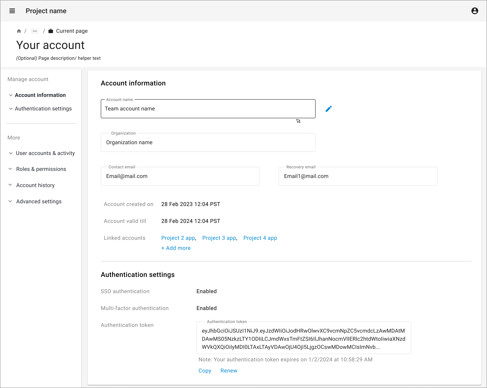
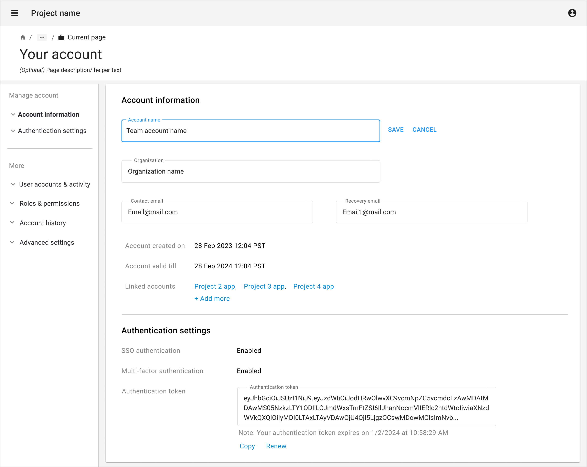

import { Grid, TableHead, TableRow, TableCell, TableBody } from '@mui/material';
import { TaskFlowCard } from '/src/components/TaskFlowCard';
import { InfoTable } from '/src/components/InfoTable';

## Overview

<Grid container spacing={4}>
  <Grid item xs={6} md={4}>
    
  </Grid>
  <Grid item xs={6} md={4}>
    
  </Grid>
</Grid>

### Guidelines for adapting the Task Flow

<ul>
  <li>
    Determine type of account to be managed - user account/ team or project account
  </li>
  <li>
    Determine primary account information needed to be accessible for viewing and editing to the users
  </li>
  <li>
    If there is a long list of information & settings, organize them into smaller relevant category groups
  </li>
  <li>
    If there are only a few settings, navigation can be on a single scrollable page
  </li>
  <li>
    Tabs can be used when there are 2-5 categories of information & settings
  </li>
  <li>
    If there many settings and categories (>5), consider a left panel for navigating through them
  </li>
  <li>
    In case of many settings, give a search option to search for settings
  </li>
  <li>
    Editing sensitive information & critical settings should give a confirmation prompt before saving the changes
  </li>
</ul>

{/*
## Variations & Examples

Aliquip ea ipsum Lorem amet incididunt excepteur Lorem aute proident deserunt commodo. Officia ipsum magna laborum dolore mollit adipisicing eiusmod. Duis irure ullamco in aliquip eu ad aliquip elit cupidatat.

## Components & Patterns Used

<InfoTable>
  <TableHead>
    <TableRow>
      <TableCell>Component</TableCell>
      <TableCell>Usage Context</TableCell>
      <TableCell>Links to Libraries</TableCell>
    </TableRow>
  </TableHead>
  <TableBody>
    <TableRow>
      <TableCell>Stepper</TableCell>
      <TableCell>Some blurb on how the component is useful in this taskflow</TableCell>
      <TableCell><a href="https://mui.com/material-ui/react-stepper/" target="_blank">MUI links to start with</a></TableCell>
    </TableRow>
    <TableRow>
      <TableCell>Data Grid</TableCell>
      <TableCell>Some blurb on how the component is useful in this taskflow</TableCell>
      <TableCell><a href="https://mui.com/x/react-data-grid/" target="_blank">MUI links to start with</a></TableCell>
    </TableRow>
    <TableRow>
      <TableCell>Date Picker</TableCell>
      <TableCell>Some blurb on how the component is useful in this taskflow</TableCell>
      <TableCell><a href="https://mui.com/x/react-date-pickers/" target="_blank">MUI links to start with</a></TableCell>
    </TableRow>
    <TableRow>
      <TableCell>Select</TableCell>
      <TableCell>Some blurb on how the component is useful in this taskflow</TableCell>
      <TableCell><a href="https://mui.com/material-ui/react-select/">MUI links to start with</a></TableCell>
    </TableRow>
  </TableBody>
</InfoTable>
*/}

## Related Task Flows

<Grid container spacing={4}>
  <Grid item md={6}>
    <TaskFlowCard name="Track State" />
  </Grid>
  <Grid item md={6}>
    <TaskFlowCard name="Monitor Activities" />
  </Grid>
</Grid>