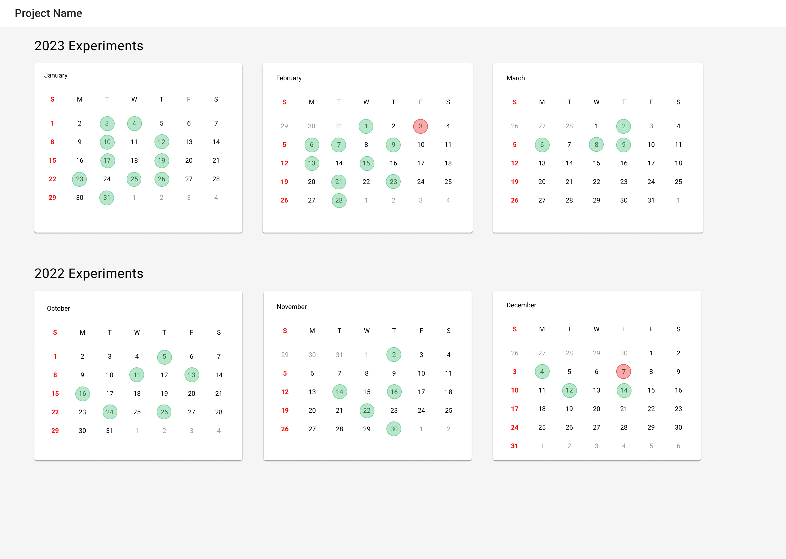
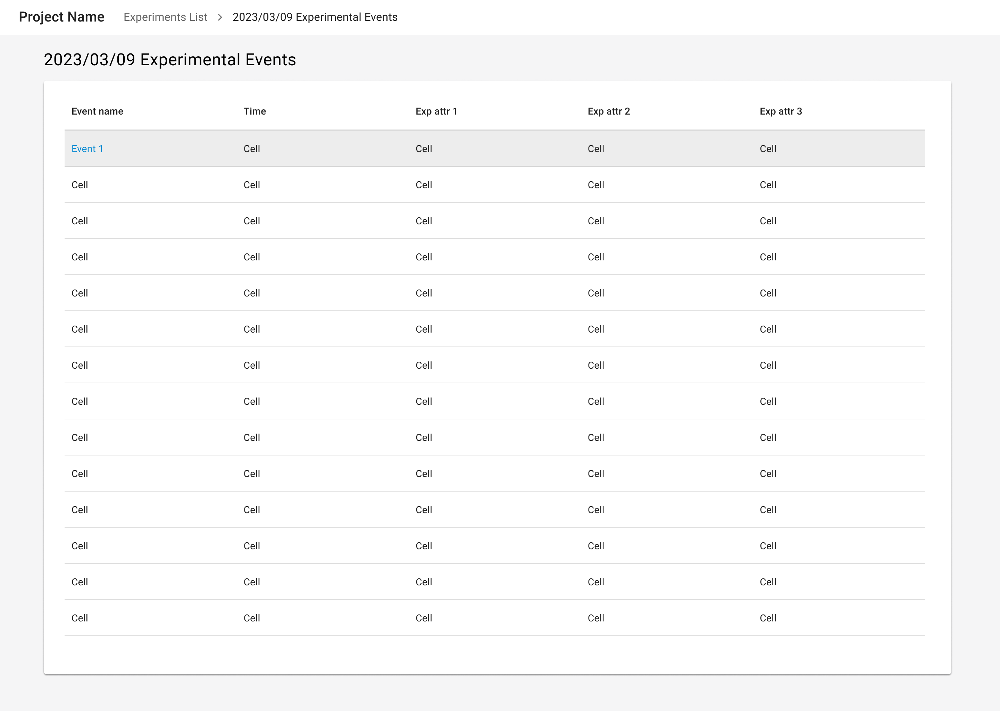
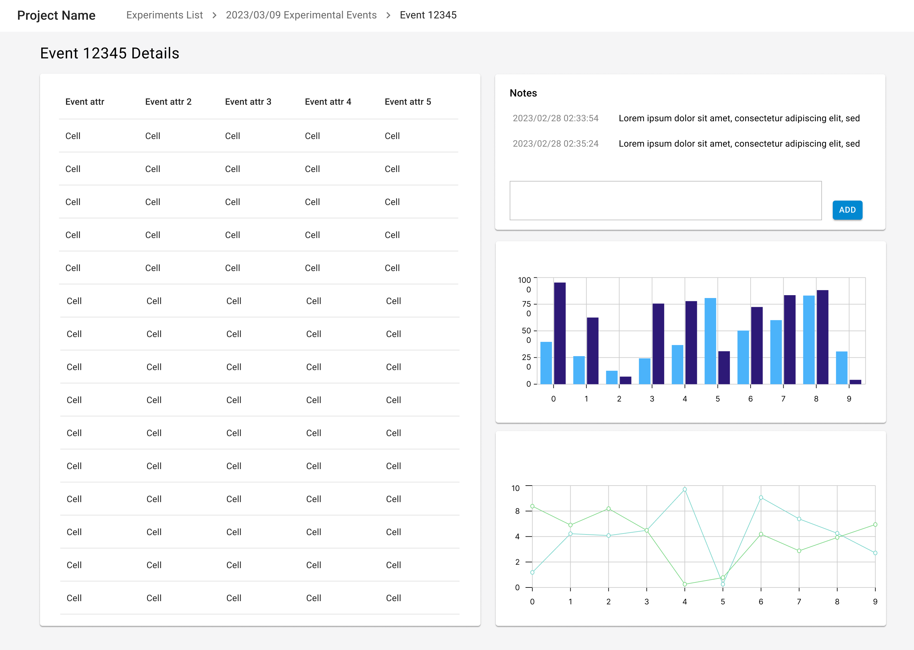

import { Grid, TableHead, TableRow, TableCell, TableBody } from '@mui/material';
import { TaskFlowCard } from '/src/components/TaskFlowCard';
import { InfoTable } from '/src/components/InfoTable';

## Overview

<Grid container spacing={4}>
  <Grid item xs={6} md={4}>
    
  </Grid>
  <Grid item xs={6} md={4}>
    
  </Grid>
  <Grid item xs={6} md={4}>
    
  </Grid>
</Grid>

### Guidelines for adapting the Task Flow

<ul>
  <li>
    <b>Real-time experiments</b>
    <ul>
      <li>
        The display should refresh to show new data as the data becomes available.
      </li>
      <li>
        If data or events need to be reviewed, highlight the new data / events to draw attention to the ones needing review.
      </li>
      <li>
        To support real-time decision making, keep the display as simple as possible with only what data is needed to make decisions. Plots and other quick analysis methods can be useful for these determinations.
      </li>
      <li>
        Consider providing a simple way for users to add notes alongside monitored events.
      </li>
      <li>
        If the monitor is to be used alongside other software, consider providing a smaller aspect ratio app for monitoring events. Provide a full desktop ratio version for more detailed work.
      </li>
    </ul>
  </li>
  <li>
    <b>Asynchronous monitors</b>
    <ul>
      <li>
        Users may rely on scanning states to help determine next steps. For example, in a job monitor, some indication if the job failed is helpful to determine if the job should be re-run. In cases of experimental observations, the state can determine if more observations are needed.
      </li>
      <li>
        While real-time monitors should be kept simple, asynchronous monitors can be much more data dense, since time is not as constrained. Rich data access can help users determine next steps.
      </li>
    </ul>
  </li>
</ul>

{/*
## Variations & Examples

Aliquip ea ipsum Lorem amet incididunt excepteur Lorem aute proident deserunt commodo. Officia ipsum magna laborum dolore mollit adipisicing eiusmod. Duis irure ullamco in aliquip eu ad aliquip elit cupidatat.

## Components & Patterns Used

<InfoTable>
  <TableHead>
    <TableRow>
      <TableCell>Component</TableCell>
      <TableCell>Usage Context</TableCell>
      <TableCell>Links to Libraries</TableCell>
    </TableRow>
  </TableHead>
  <TableBody>
    <TableRow>
      <TableCell>Stepper</TableCell>
      <TableCell>Some blurb on how the component is useful in this taskflow</TableCell>
      <TableCell><a href="https://mui.com/material-ui/react-stepper/" target="_blank">MUI links to start with</a></TableCell>
    </TableRow>
    <TableRow>
      <TableCell>Data Grid</TableCell>
      <TableCell>Some blurb on how the component is useful in this taskflow</TableCell>
      <TableCell><a href="https://mui.com/x/react-data-grid/" target="_blank">MUI links to start with</a></TableCell>
    </TableRow>
    <TableRow>
      <TableCell>Date Picker</TableCell>
      <TableCell>Some blurb on how the component is useful in this taskflow</TableCell>
      <TableCell><a href="https://mui.com/x/react-date-pickers/" target="_blank">MUI links to start with</a></TableCell>
    </TableRow>
    <TableRow>
      <TableCell>Select</TableCell>
      <TableCell>Some blurb on how the component is useful in this taskflow</TableCell>
      <TableCell><a href="https://mui.com/material-ui/react-select/">MUI links to start with</a></TableCell>
    </TableRow>
  </TableBody>
</InfoTable>
*/}

## Related Task Flows

<Grid container spacing={4}>
  <Grid item md={6}>
    <TaskFlowCard name="Track State" />
  </Grid>
  <Grid item md={6}>
    <TaskFlowCard name="Explore Data" />
  </Grid>
</Grid>