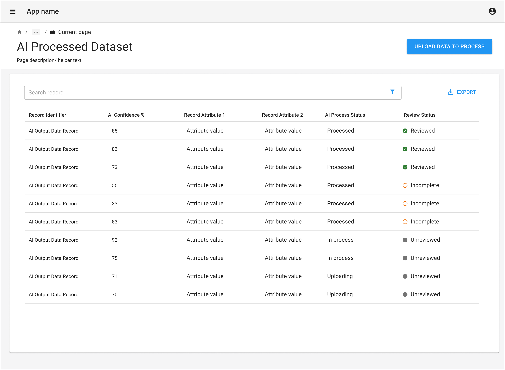
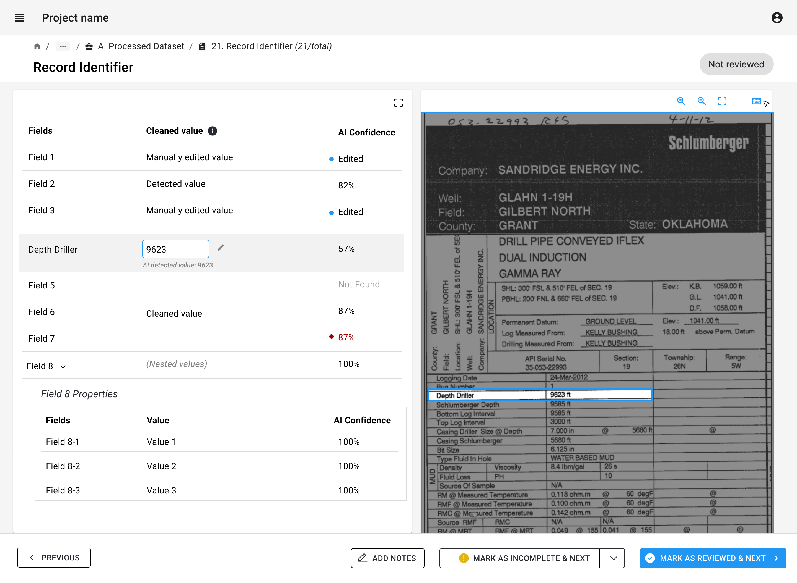
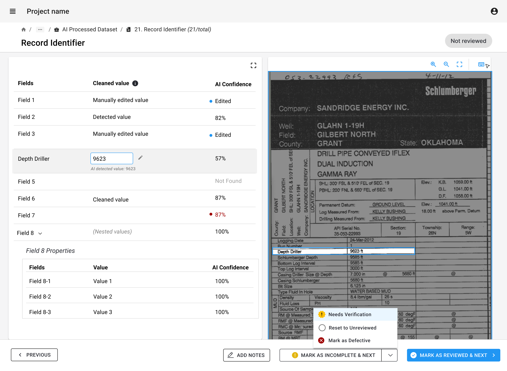
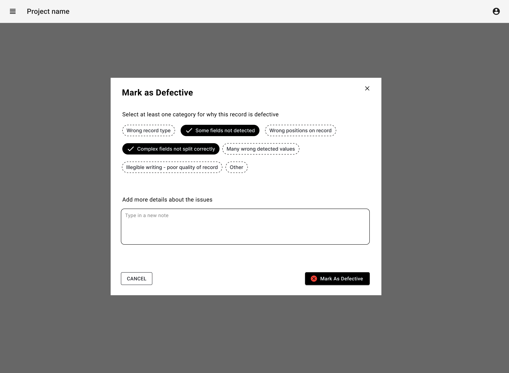

import { Grid, TableHead, TableRow, TableCell, TableBody } from '@mui/material';
import { TaskFlowCard } from '/src/components/TaskFlowCard';
import { InfoTable } from '/src/components/InfoTable';

## Overview

<Grid container spacing={4}>
  <Grid item xs={6} md={4}>
    
  </Grid>
  <Grid item xs={6} md={4}>
    
  </Grid>
  <Grid item xs={6} md={4}>
    
  </Grid>
  <Grid item xs={6} md={4}>
    
  </Grid>
  <Grid item xs={6} md={4}>
    
  </Grid>
</Grid>

### Guidelines for adapting the Task Flow

<ul>
  <li>
    Showing original datafile along side the ai processed data output helps to compare and review effectively. 
  </li>
  <li>
    Evaluate the granularity of review required, whether review is needed for selected sections/ fields or entire datafile. Highlight corresponding sections in both views when hovering or clicking on granular processed data.
  </li>
  <li>
    Show confidence levels from AI process and highlight low-confidence areas to enable easy scanning and priority review.
  </li>
  <li>
    Implement an automated process for data validation and correction to enforce consistent field formats and identification of erroneous or high-priority sections for review.
  </li>
  <li>
    Determine whether the review process requires a secondary reviewer or additional validation steps, and provide actions to flag a data file for a second opinion.
  </li>
  <li>
    Consider adding keyboard shortcuts for quick navigation and corrections thus speeding the review process for users
  </li>
  <li>
    Support export of reviewed data in required formats (CSV, JSON, XML, etc.), which can help integration with downstream systems (databases, content management, analytics)
  </li>
</ul>

{/*
## Variations & Examples

Aliquip ea ipsum Lorem amet incididunt excepteur Lorem aute proident deserunt commodo. Officia ipsum magna laborum dolore mollit adipisicing eiusmod. Duis irure ullamco in aliquip eu ad aliquip elit cupidatat.

*/}

## Related Task Flows

<Grid container spacing={4}>
  <Grid item md={6}>
    <TaskFlowCard name="Track State" />
  </Grid>
  <Grid item md={6}>
    <TaskFlowCard name="Explore Data" />
  </Grid>
</Grid>