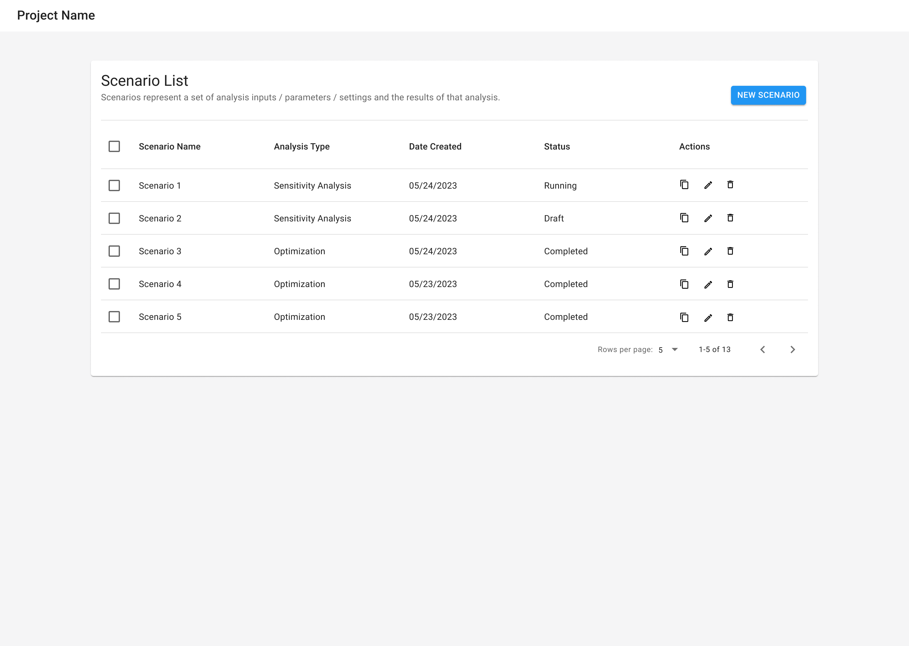
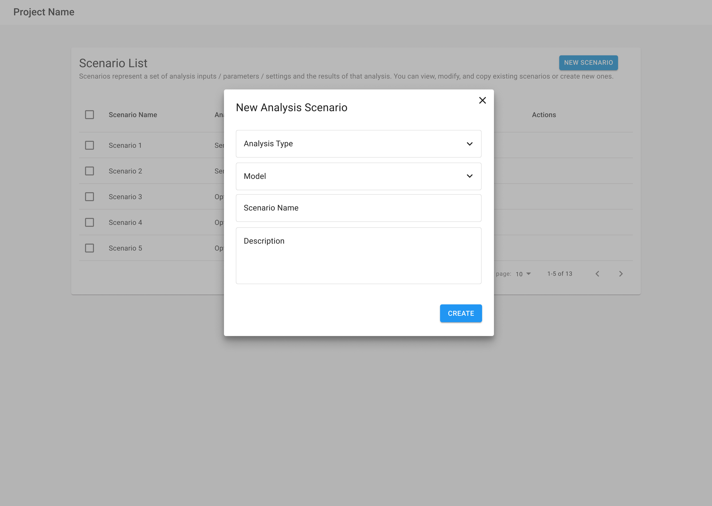
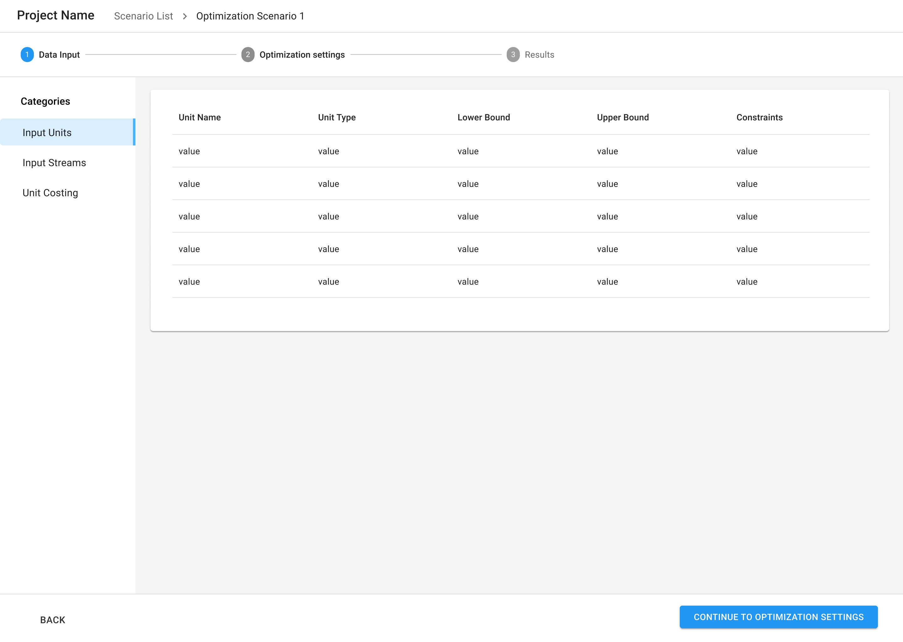
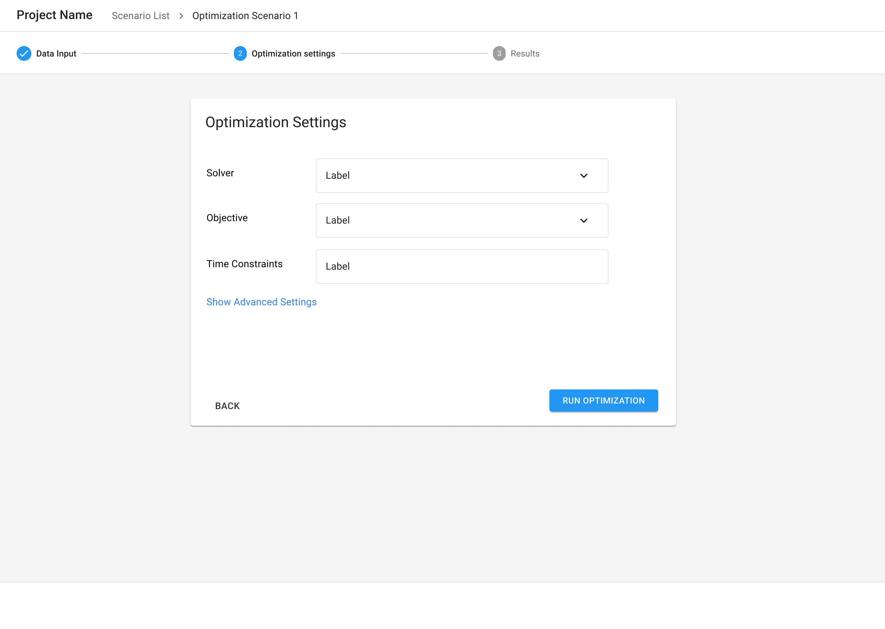
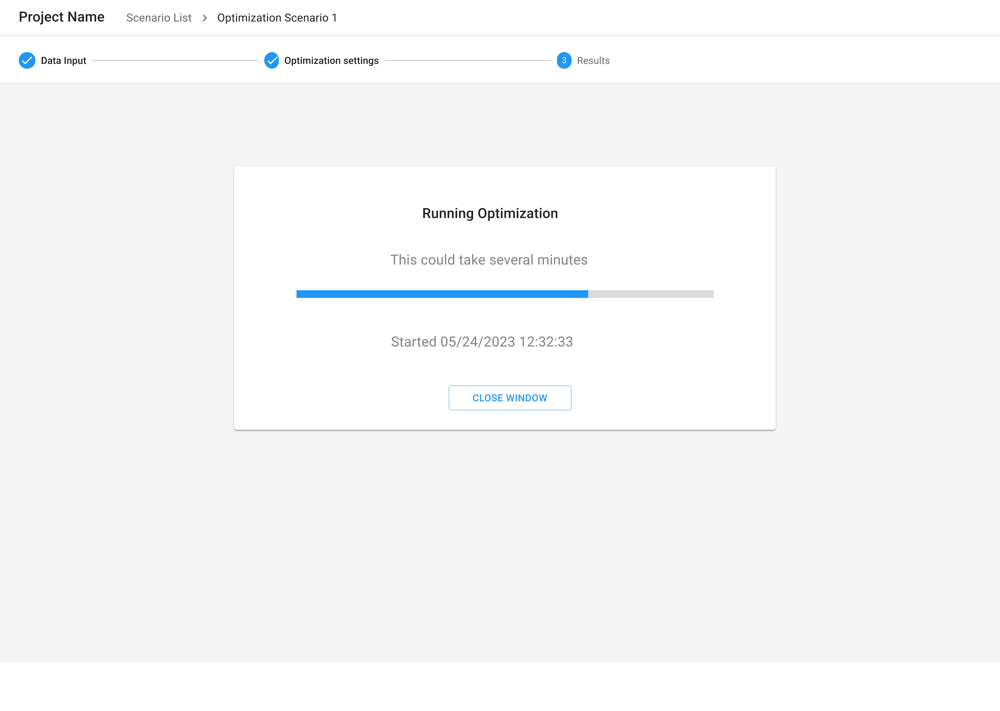
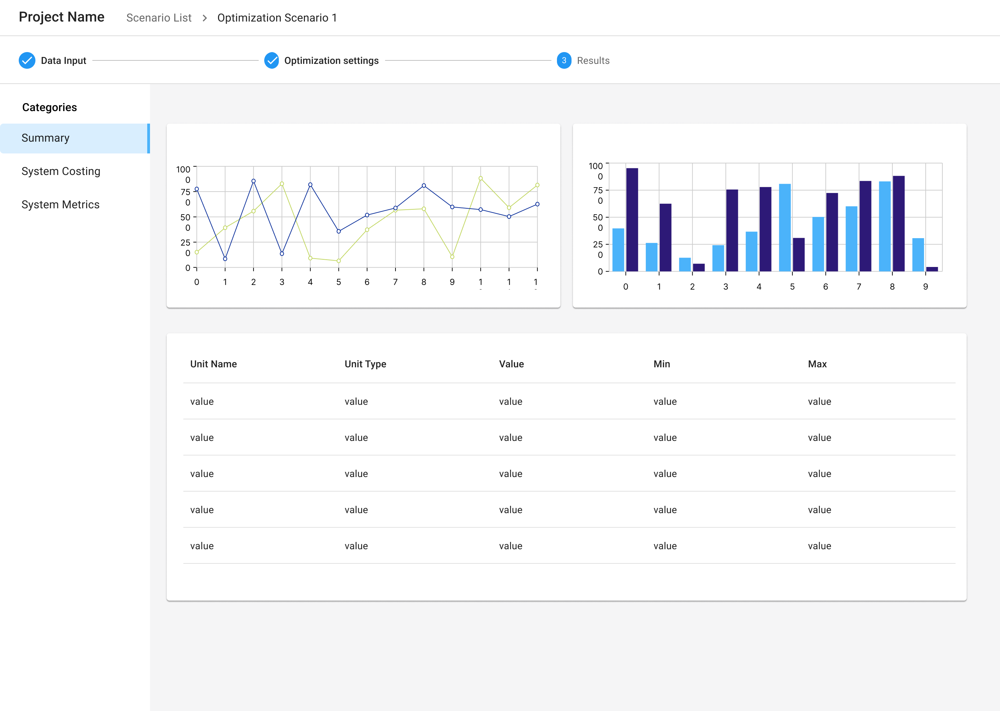

import { Grid, TableHead, TableRow, TableCell, TableBody } from '@mui/material';
import { TaskFlowCard } from '/src/components/TaskFlowCard';
import { InfoTable } from '/src/components/InfoTable';

## Overview

<Grid container spacing={4}>
  <Grid item xs={6} md={4}>
    
  </Grid>
  <Grid item xs={6} md={4}>
    
  </Grid>
  <Grid item xs={6} md={4}>
    
  </Grid>
  <Grid item xs={6} md={4}>
    
  </Grid>
  <Grid item xs={6} md={4}>
    
  </Grid>
  <Grid item xs={6} md={4}>
    
  </Grid>
</Grid>

### Guidelines for adapting the Task Flow

<ul>
  <li>
    Break the task flow into multiple workable steps and use a progress indicator / stepper to help users see the progress and remaining steps in the process to complete.
  </li>
  <li>
    Organize information into sections that are easy to digest. This helps improve the readability and searchability.
  </li>
  <li>
    Offer guidance, tips, and links to detailed documentation for complex inputs & interactions.
  </li>
  <li>
    Pre-fill the forms with sensible default values wherever possible, especially if data inputs require long forms.
  </li>
  <li>
    Consider allowing users to upload input data as external files or spreadsheets, especially for computations that require large amounts of input data. 
  </li>
  <li>
    Make attributes searchable and filterable to make it easy to find attributes of interests.
  </li>
  <li>
    Give real time error warnings for mis-configurations, especially for long complex forms. For example, specify bounds for values and provide warnings if values are outside of bounds.
  </li>
  <li>
    Help users recover from failed computations by providing meaningful and actionable error messages and allow them to go back and change configurations and inputs.
  </li>
  <li>
    Don’t break the workflow into too many small steps. Users may perceive this as a long and overwhelming process to complete.
  </li>
  <li>
    Don’t assume users will understand each input field and the values to configure it. Provide contextual information when able.
  </li>
</ul>

{/*
## Variations & Examples

Aliquip ea ipsum Lorem amet incididunt excepteur Lorem aute proident deserunt commodo. Officia ipsum magna laborum dolore mollit adipisicing eiusmod. Duis irure ullamco in aliquip eu ad aliquip elit cupidatat.

## Components & Patterns Used

<InfoTable>
  <TableHead>
    <TableRow>
      <TableCell>Component</TableCell>
      <TableCell>Usage Context</TableCell>
      <TableCell>Links to Libraries</TableCell>
    </TableRow>
  </TableHead>
  <TableBody>
    <TableRow>
      <TableCell>Stepper</TableCell>
      <TableCell>Some blurb on how the component is useful in this taskflow</TableCell>
      <TableCell><a href="https://mui.com/material-ui/react-stepper/" target="_blank">MUI links to start with</a></TableCell>
    </TableRow>
    <TableRow>
      <TableCell>Data Grid</TableCell>
      <TableCell>Some blurb on how the component is useful in this taskflow</TableCell>
      <TableCell><a href="https://mui.com/x/react-data-grid/" target="_blank">MUI links to start with</a></TableCell>
    </TableRow>
    <TableRow>
      <TableCell>Date Picker</TableCell>
      <TableCell>Some blurb on how the component is useful in this taskflow</TableCell>
      <TableCell><a href="https://mui.com/x/react-date-pickers/" target="_blank">MUI links to start with</a></TableCell>
    </TableRow>
    <TableRow>
      <TableCell>Select</TableCell>
      <TableCell>Some blurb on how the component is useful in this taskflow</TableCell>
      <TableCell><a href="https://mui.com/material-ui/react-select/" target="_blank">MUI links to start with</a></TableCell>
    </TableRow>
  </TableBody>
</InfoTable>
*/}

## Related Task Flows

<Grid container spacing={4}>
  <Grid item md={6}>
    <TaskFlowCard name="Run Interactive Computation" />
  </Grid>
  <Grid item md={6}>
    <TaskFlowCard name="Explore Data" />
  </Grid>
</Grid>