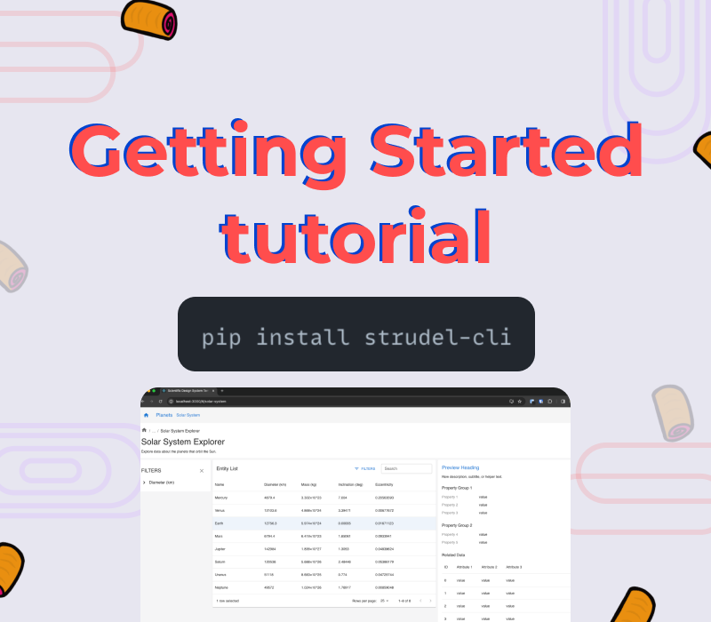

import { Button, Grid, Stack, Typography, Box, Link as MuiLink } from '@mui/material';
import { Hero } from '/src/components/Hero';
import { PageContainer } from '/src/components/PageContainer';
import { ContentCard } from '/src/components/ContentCard';
import { ResponsiveImageWrapper } from '/src/components/ResponsiveImageWrapper';
import { StaticImage } from 'gatsby-plugin-image';
import { Link } from 'gatsby';

<Hero>
  Step-by-step guides on using the STRUDEL Design System and STRUDEL Kit, the software toolkit for implementing STRUDEL Task Flows.
</Hero>
<PageContainer>
  <ContentCard
    variant="dot-outlined" 
    sx={{ 
      padding: 0,
    }}
  >
    <Grid container>
      <Grid item md={9}>
        <Stack
          sx={{
            justifyContent: 'space-between',
            height: '100%',
            padding: 3,
          }}
        >
          <Stack spacing={2}>
            <Typography variant="h6" sx={{ marginBottom: '0 !important' }}>
              <MuiLink href="https://strudel.science/strudel-kit/docs/tutorials/basic-app-with-strudel/introduction/" target="_blank">
                Getting Started with STRUDEL Kit
              </MuiLink>
            </Typography>
            <Typography>
              Learn how to implement a Task Flow in the STRUDEL Design System into a functional web application.
            </Typography>
            <Stack 
              direction="row"
              spacing={1}
              sx={{
                alignItems: 'center',
              }}
            >
              <Button 
                variant="contained" 
                href="https://strudel.science/strudel-kit/docs/tutorials/basic-app-with-strudel/introduction/"
                target="_blank"
              >
                See tutorial
              </Button>
            </Stack>
          </Stack>
        </Stack>
      </Grid>
      <Grid item md={3}>
        <Box
          sx={{
            backgroundColor: 'neutral.main',
            borderRadius: '0 10px 10px 0',
            height: '100%',
            width: '100%',
            overflow: 'hidden',
            pointerEvents: 'none',
          }}
        >
          
        </Box>
      </Grid>
    </Grid>
  </ContentCard>
</PageContainer>
