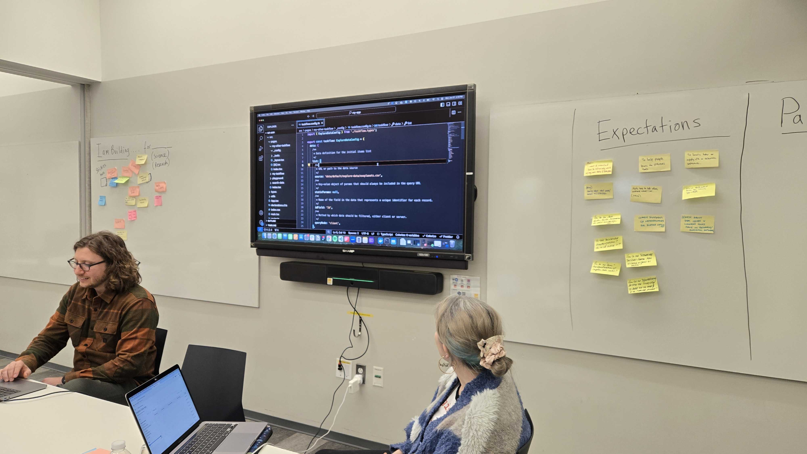
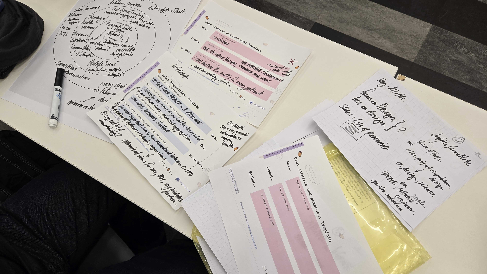

import { Grid } from '@mui/material';

The STRUDEL team hosted an in person hackathon at MIT in Cambridge, Massachusetts, which focused on the intersection of User Experience (UX) design and science. Attendees gained hands-on experience with key UX research methods, including stakeholder identification, goal prioritization, and user scenario creation. They also learned how to leverage the STRUDEL Design System and adapt Task Flows to address their unique user needs and scenarios.

The session was highly interactive, with attendees contributing to lively discussions and brainstorming sessions on the hackathon's flow and opportunities for STRUDEL to grow and expand. We're grateful to all the attendees who joined us for a productive and engaging day!

<Grid container spacing={2}>
  <Grid item xs={6} md={4}>
    
  </Grid>
  <Grid item xs={6} md={4}>
    
  </Grid>
</Grid>

***Interested in hosting or attending a future hackathon? Reach out via email or GitHub!***