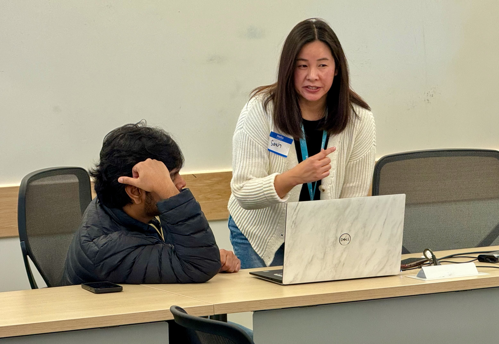
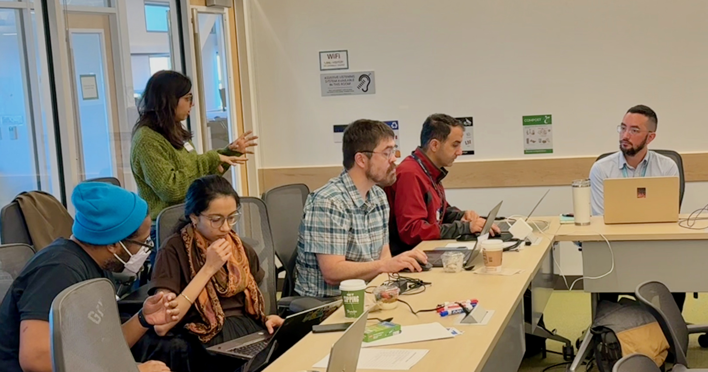
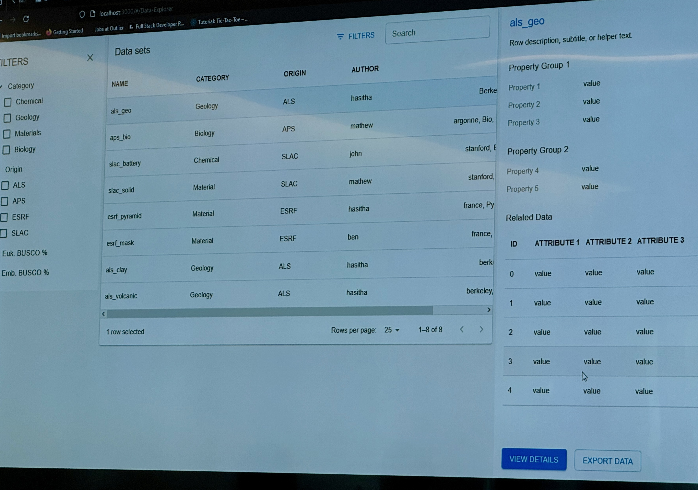

import { Grid } from '@mui/material';

The STRUDEL team hosted an in person hackathon at Berkeley Lab to help scientific teams prototype a web application over a few hours. Attendees learned about the STRUDEL Design System and explored available Task Flows to adapt them to address a development need for their team's software.

<Grid container spacing={2}>
  <Grid item xs={6} md={4}>
    
  </Grid>
  <Grid item xs={6} md={4}>
    
  </Grid>
  <Grid item xs={6} md={4}>
    
  </Grid>
  <Grid item xs={6} md={4}>
    
  </Grid>
</Grid>

***Interested in hosting or attending a future hackathon? Reach out via email or GitHub!***