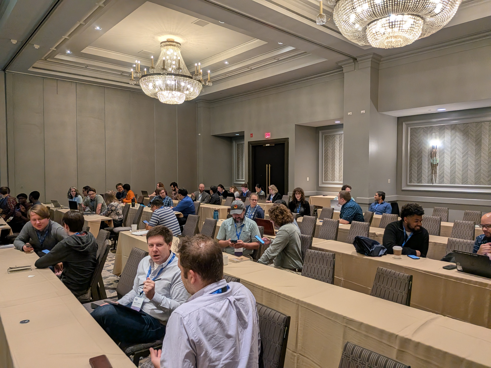

import { Grid } from '@mui/material';

The STRUDEL team hosted a hands-on, in-person workshop with over 50 participants at the <a href="https://us-rse.org/usrse25/program/" target="_blank">US-RSE 2025 Conference</a> in Philadelphia. This workshop provided research software engineers with applied training in conducting semi-structured user interviews to inform their requirements and decision making processes when building scientific software. 

Semi-structured interviews allow for the collection of rich, qualitative data on users' experiences, perspectives, values, and challenges. These interviews help gather actionable feedback and guide future development priorities so that research software products can align with their focal user’s needs and improve usability.

The workshop was structured to cover three key areas: recruitment and protocol development, conducting interviews, and data analysis. Through a combination of presentations, interactive exercises, and group discussions, participants gained practical experience and knowledge in designing and executing effective semi-structured interviews. To support continued learning, attendees received reusable resources for future reference.

With over 50 participants in attendance, the workshop was a resounding success, offering valuable instruction and sparking lots of engagement throughout the room. The high level of interest and curiosity among attendees was evident, with requests to learn more about user research and also to reuse the workshop structure and materials. 

By the end of the session the workshop equipped research software engineers with the skills and confidence to integrate semi-structured user interviews into their own research environments and software work. 

You can access the slides shared during the workshop here <a href="https://zenodo.org/records/17362664" target="_blank">here</a>.

  

<Grid container spacing={2}>
  <Grid item xs={12} md={6}>
    
  </Grid>
  <Grid item xs={12} md={6}>
    
  </Grid>
</Grid>