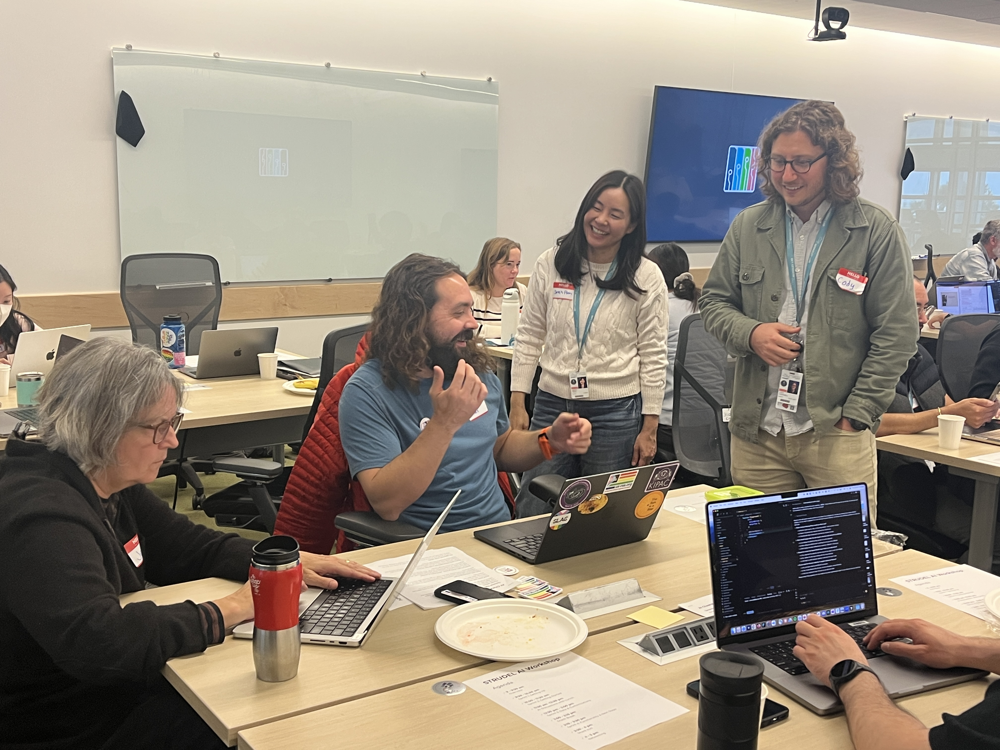

import { Grid } from '@mui/material';

The STRUDEL team hosted a dynamic, all-day workshop with over thirty participants prototyping web applications using the STRUDEL Design System and AI assistants on 23rd Oct, 2025. This exciting opportunity enabled participants and the STRUDEL team to explore how to effectively use generative AI tooling alongside colleagues from a range of scientific disciplines. The majority of participants had little-to-no experience with the tools backing the STRUDEL Design System templates (React, TypeScript), yet generated impressive prototypes in a day. These prototypes leveraged design patterns embedded in the STRUDEL Design System while meeting particular scientific goals. The multi-organization STRUDEL team facilitated the workshop with funding from the Sloan Foundation.

STRUDEL provides resources that enable teams to design and build consistently usable, scalable experiences with common components, patterns, and guidelines. The STRUDEL Design System incorporates components and patterns into code templates so that research software teams can rapidly deploy usable front-ends for their scientific applications.

Attendees were grateful to the STRUDEL team for their work organizing the event and all felt like they were able to dig into a variety of topics during the day. The prototypes participants built addressed real problems from various scientific areas, from astrophysics to genomics, energy technologies, water quality, and light sources. The prototypes can impact discovery and operations in this broad range of scientific environments. Above all, the workshop provided a great opportunity to share challenges, insights, and grow community across organizations.

*“I just want to express my gratitude for such an awesome day today. The workshop was really well structured and facilitated, and I learned a lot. Thank you so much for letting me come!”*

The STRUDEL team and workshop participants came away with multiple vital lessons learned. Bringing together STRUDEL and AI assistants was absolutely essential to ensuring workshop participants went from application concept to interactive prototype in the same day. The STRUDEL Design System’s Task Flow templates, documentation, and starter code base provided the essential scaffolding to rapidly stand up a functional scientific web app. Working in a <a href="https://code.visualstudio.com/" target="_blank"> VS Code </a>environment the <a href="http://cline.bot" target="_blank"> Cline AI </a> assistant brought a key AI thinking partner to the table. The STRUDEL team configured the Cline AI assistant with <a href="https://openrouter.ai/" target="_blank"> OpenRouter </a> to provide access to a range of AI models (Claude, Gemini, etc.) and incorporated STRUDEL documentation to provide core knowledge to the system. This was essential to enable users of all backgrounds to very quickly begin adapting a base STRUDEL application to solve their problems.

Another significant takeaway was the importance of effectively configuring the AI assistant with baseline resources. Workshop attendees found that the AI assistant did not perform as effectively without the STRUDEL team’s customization to leverage design system documentation. One noted how removing all documentation caused the AI tool to struggle at reimplementing jobs.

*“Interestingly, if I remove all documentation from the STRUDEL repo (using a separate Cline task) it struggles to re-implement Jobs. So current STRUDEL documentation is clearly helping it.”*

Reducing the burden of setting up a development environment when prototyping was another key takeaway. Our <a href="http://2i2ic.org" target="_blank"> 2i2c</a> partners created a dedicated STRUDEL environment pre-configured with everything an end user needs to begin prototyping from their browser window. The space provided by 2i2c allowed STRUDEL to test and configure the Cline VS Code extension along with OpenRouter. Adopting OpenRouter to provide access to a wide range of cutting edge AI models for coding ensured that workshop participants could select among a range of models. Individuals were even able to swap between models over the day to test performance and features. All while working in an environment optimized for prototyping with STRUDEL Design System.

*“Having a startup environment was very nice, as often getting a good development environment set up is half the battle for smaller projects.”*

The STRUDEL team supplemented the dedicated environment and AI tooling with a cheatsheet of AI tips and tricks, including suggested prompts. The tips, tricks, and suggested prompts were the result of the team’s work exploring how to best use different AI assistants when prototyping web apps. Conducting this exploratory work and crafting core guidance amplified the ability of novice and experienced developers to successfully and rapidly prototype with STRUDEL during the course of the day. The team has gathered these insights in the <a href="https://strudel.science/strudel-kit/docs/usage-with-ai" target="_blank"> STRUDEL documentation </a>  for all to learn from and use in their own development activities.

Overall, the STRUDEL team found that this workshop demonstrated the utility of AI assistants combined with the STRUDEL Design System and templates to enable rapid prototyping of essential scientific applications. 
