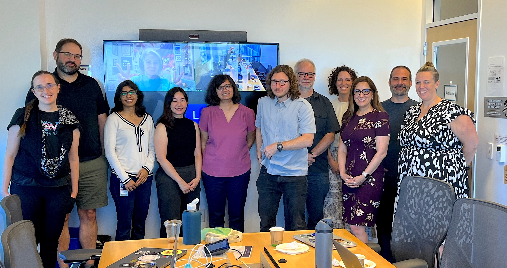

STRUDEL is building products to help scientific software teams improve the user experience and impact of their work. Learn more at [https://strudel.science](https://strudel.science) and reach out if you have questions or would like to collaborate as the project enters its next phase.

<h2>Upcoming Events</h2>

- <b>[Supercomputing 2024 (SC|24) Participation](https://sc24.supercomputing.org/)</b>  
     Drew Paine and Lavanya Ramakrishnan from the STRUDEL team will be at Supercomputer 2024 in Atlanta. Please reach out if you would be interested in chatting or visit us during the following events:
     - <b>Sunday, November 17</b>: Drew Paine is discussing UX as part of Research Software Engineering culture during the [RSEs in HPC](https://us-rse.org/rse-hpc-2024/agenda/) workshop on Sunday Nov 17th.
     - <b>Monday, November 18</b>: Drew will present a lightning talk on behalf of the STRUDEL team at the [WORKS 2024](https://works-workshop.org/) workshop.
     - <b>Wednesday, November 20, 12-2pm</b>: Drew will also be volunteering at the US-RSE organization booth (#4504).

- <b>[US-RSE UX Working Group Meetings](https://us-rse.org/working-groups/)</b>  
    The next UX Working Group meeting is November 18, from 2pm-3pm EST. Zoom link [here](https://lbnl.zoom.us/j/95364223538?pwd=OdC7ksl0vxRa36noqN0PcD3jjOz5rg.1). We’ll be gathering examples to show demand for UX resources like STRUDEL and practicing interview skills. All are invited!
    
- <b>U.S. East Coast Hackathon</b>  
    The STRUDEL team will be hosting a hackathon to help scientific software teams get started with the STRUDEL Design System.

<h2>Recent Activities</h2>

- <b>US-RSE Conference 2024</b>  
    The STRUDEL team recently participated in the 2nd annual US-RSE Conference in Albuquerque, New Mexico. The tutorial “Rapid Prototyping for a Usable React-based Web Application with STRUDEL” was presented by Rajshree Deshmukh, Cody O'Donnell, and Lavanya Ramakrishnan. 
    A recording is available on [YouTube](https://youtu.be/g7rcjWPWX4U?si=S17Ku7LBlh9RvlWV)

- <b>The Carpentries Instructor Training</b>
    Three members of the STRUDEL team participated in The Carpentries Instructor Training in October and November, in preparation for curriculum development activities. 

- <b>Team Kickoff</b>
    The STRUDEL team kicked off its latest phase of work with a two day in person meeting with members from all four organizations in October. 
    

    

