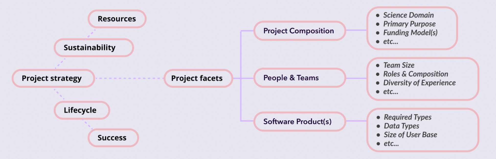

import { Grid, Stack, Box, Typography } from '@mui/material';
import ArrowForwardIcon from '@mui/icons-material/ArrowForward';
import PlaceIcon from '@mui/icons-material/Place';
import { Hero } from '/src/components/Hero';
import { PageSection } from '/src/components/PageSection';
import { ContentCard } from '/src/components/ContentCard';
import { Button } from 'gatsby-theme-material-ui';
import EventIcon from '@mui/icons-material/Event';
import { Link } from '@mui/material';

<PageSection containerWidth="lg">
  <Stack
    sx={{
      alignItems: 'center',
      textAlign: 'center',
      paddingTop: '24px',
      paddingBottom: '24px'
    }}
  >
    <Box
      sx={{
        flexShrink: 0,
        maxWidth: '600px',
        minWidth: '300px',
        pointerEvents: 'none',
        width: '75%',
      }}
    >
      
    </Box>
    <Box 
      sx={{
        fontSize: '1.5rem',
        maxWidth: '650px',
        paddingTop: '24px'
      }}
    >
      Scientific sofTware Research for User experience, Design, Engagement, and Learning
    </Box>
  </Stack>
</PageSection>
<Hero containerWidth="lg" sideRibbon="left">
  <Stack spacing={4}>
    <Box 
      sx={{
        fontSize: '1.25rem',
        textAlign: 'center',
        '& > *': {
          marginBottom: 0,
          marginTop: 0,
        }
      }}
    >
      STRUDEL enables teams to create user-centered software for scientific communities.
      
      Plan, design, and build better scientific software projects using STRUDEL Planning Framework and Design System.
    </Box>
    <ContentCard variant="outlined" sx={{ padding: 0 }}>
      <Grid container sx={{ minHeight: '250px' }}>
        <Grid item md={4} xs={12}>
          <Stack
            sx={{
              justifyContent: 'space-between',
              height: '100%',
              padding: 3,
            }}
          >
            <Box>
              ## Build Scientific UIs

              UI Task Flow library & guides to streamline scientific software UI design and development.
            </Box>
            <Box>
              <Button 
                to="/design-system/overview"
                size="large"
                variant="contained"
                endIcon={<ArrowForwardIcon />}
                sx={{ color: '#ffffff !important', marginTop: '16px'}}
              >
                Get started
              </Button>
            </Box>
          </Stack>
        </Grid>
        <Grid item md={8} xs={12}>
          <Box
            sx={{
              alignItems: 'center',
              backgroundColor: 'neutral.main',
              borderRadius: '0 15px 15px 0',
              display: 'flex',
              height: '100%',
              overflow: 'hidden',
              pointerEvents: 'none',
            }}
          >
            <Grid container spacing={2} padding={2}>
              <Grid item md={4} xs={4}>
                
              </Grid>
              <Grid item md={4} xs={4}>
                
              </Grid>
              <Grid item md={4} xs={4}>
                
              </Grid>
            </Grid>
          </Box>
        </Grid>
      </Grid>
    </ContentCard>
    <ContentCard variant="outlined" sx={{ padding: 0 }}>
      <Grid container sx={{ minHeight: '250px' }}>
        <Grid item md={4} xs={12} >
          <Stack
            sx={{
              justifyContent: 'space-between',
              height: '100%',
              padding: 3,
            }}
          >
            <Box>
              ## Plan your UX strategy

              Questions, guidelines, and insights to help teams incorporate UX into project planning and execution.
            </Box>
            <Box>
              <Button 
                to="/planning-framework/overview"
                size="large"
                variant="contained"
                endIcon={<ArrowForwardIcon />}
                sx={{ color: '#ffffff !important' ,  marginTop: '16px'}}
              >
                Learn more
              </Button>
            </Box>
          </Stack>
        </Grid>
        <Grid item md={8} xs={12}>
          <Box
            sx={{
              alignItems: 'center',
              backgroundColor: 'neutral.main',
              borderRadius: '0 15px 15px 0',
              display: 'flex',
              height: '100%',
              overflow: 'hidden',
              pointerEvents: 'none',
            }}
          >
            <Grid container spacing={2} padding={2}>
              <Grid item  xs={12}>
                
              </Grid>
            </Grid>

          </Box>
        </Grid>
      </Grid>
    </ContentCard>
  </Stack>
</Hero>
<PageSection containerWidth="lg" sideRibbon="right" sx={{ paddingBottom: 8 }}>
  ## Events & News

  <Grid container spacing={4} sx={{ minHeight: '300px' }}>
    <Grid item md={4}>
      <ContentCard variant="light" sx={{ height: '100%' }}>
        <Stack
          sx={{
            justifyContent: 'space-between',
            height: '100%',
          }}
        >
          <Box>
            ## Hackathon: Building Better UX in Science

            Join us for an in-person hackathon focused on the intersection of User Experience (UX) design and science!  
            <Stack spacing={2}>
              <Stack direction="row" spacing={1}> <EventIcon /> <Typography> Monday, January 27th, 2025 </Typography>  </Stack>
              <Stack direction="row" spacing={1}> <PlaceIcon /> <Typography> Massachusetts Institute of Technology in Cambridge, MA.</Typography> </Stack>
            </Stack>
          </Box>
          <Box marginTop="16px">
            <Button 
              to="/engage/events/01-27-2025-building-better-ux-in-science"
              target="_blank"
              size="large"
              endIcon={<ArrowForwardIcon />}
            >
              Learn more
            </Button>
            </Box>
        </Stack>
      </ContentCard>
    </Grid>
    <Grid item md={4}>
      <ContentCard variant="light" sx={{ height: '100%' }}>
        <Stack
          sx={{
            justifyContent: 'space-between',
            height: '100%',
          }}
        >
          <Box>
            ## US-RSE UX working group

            STRUDEL helped form a working group dedicated to UX in the US-RSE community in November 2023. Visit the US-RSE site for more information and join us on Slack!
          </Box>
          <Box marginTop="16px">
            <Button 
              to="https://us-rse.org/wg/ux/"
              target="_blank"
              size="large"
              endIcon={<ArrowForwardIcon />}
            >
              US-RSE UX Working Group
            </Button>
          </Box>
        </Stack>
      </ContentCard>
    </Grid>
    <Grid item md={4}>
      <ContentCard variant="outlined" sx={{ height: '100%' }}>
        <Stack
          sx={{
            justifyContent: 'space-between',
            height: '100%',
          }}
        >
          <Box fontSize="1.25rem">
            Catch up on our news, events, blogs and more.
          </Box>
          <Box marginTop="16px">
            <Button 
              to="/engage/news"
              size="large"
              variant="contained"
            >
              See all updates
            </Button>
          </Box>
        </Stack>
      </ContentCard>
    </Grid>
  </Grid>
</PageSection>